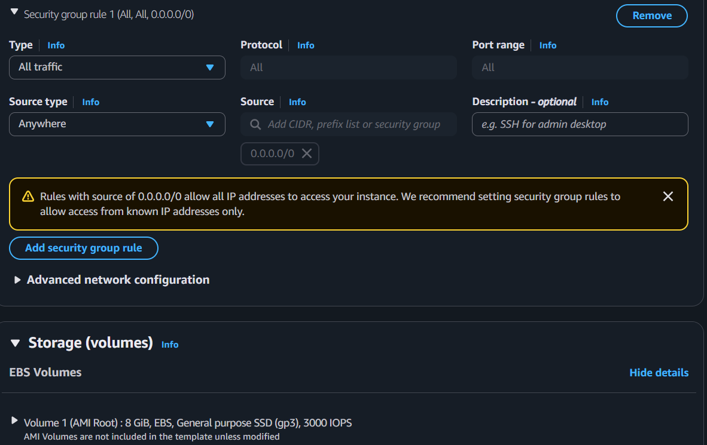

##### Create launch template
* Launch template→ Create launch template

* Choose AMI:

* Choose the instance type:

* Network settings:
     * As a AWS best practice, don’t specify the subnet details inside the launch template instead specify while configuring ASG.

    * Create the Security group:

_____
##### Create Auto Scaling Group
