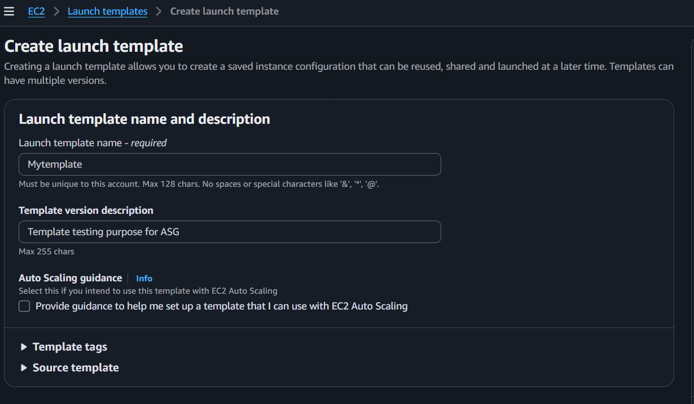
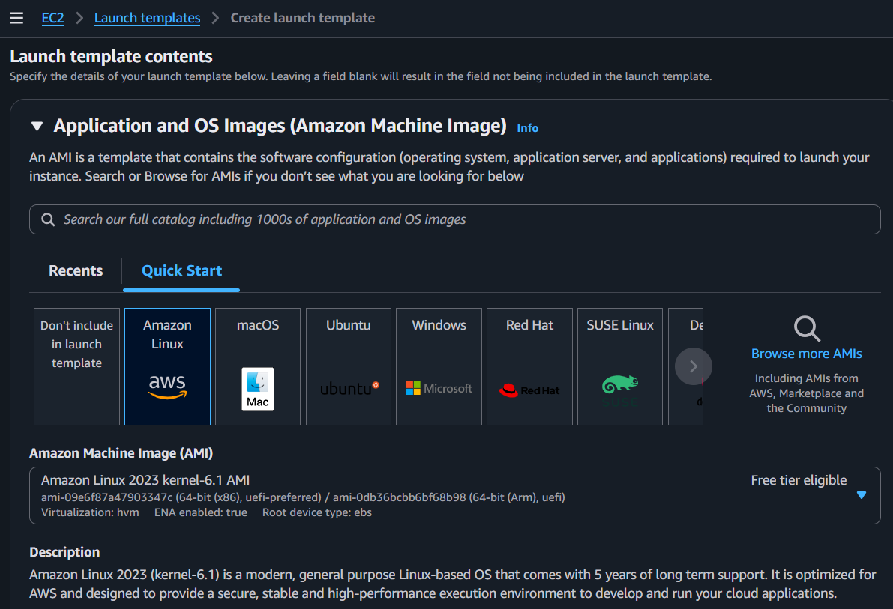
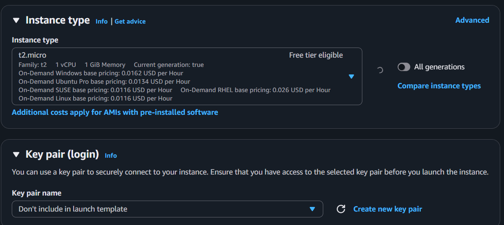
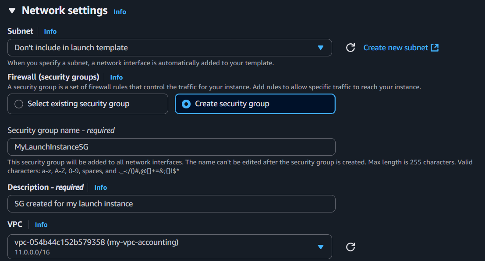
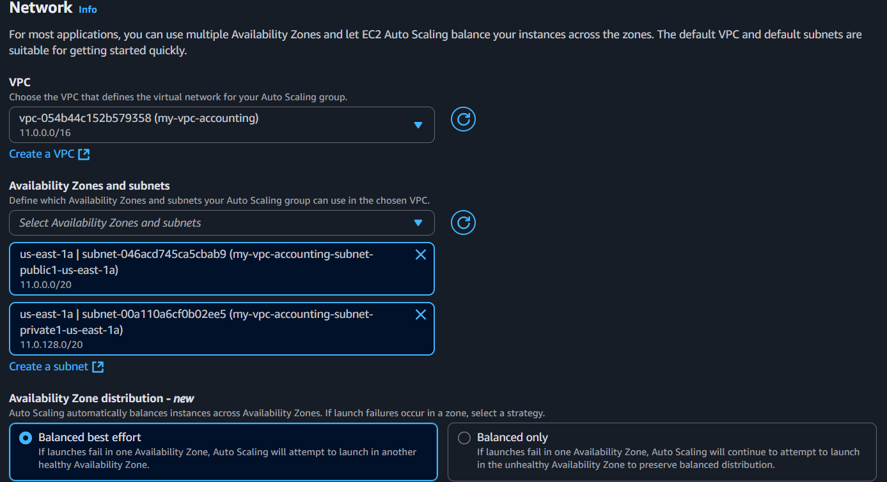
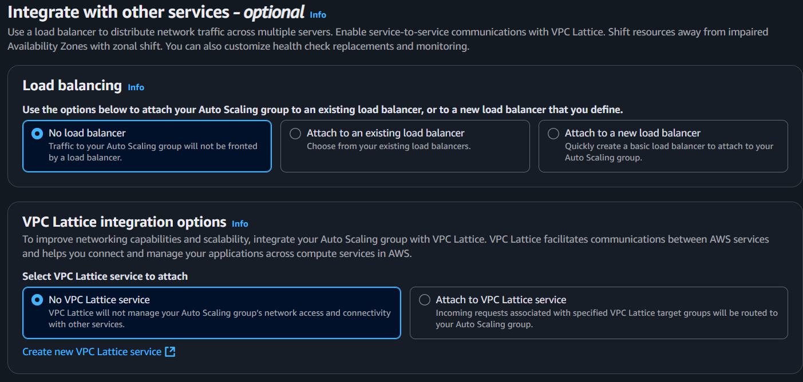

##### Create launch template
* Launch template→ Create launch template

* Choose AMI:

* Choose the instance type:

* Network settings:
     * As a AWS best practice, don’t specify the subnet details inside the launch template instead specify while configuring ASG.

* Create the Security group:

_____
##### Create Auto Scaling Group
* EC2→ Auto Scaling Group→ Create Auto Scaling Group
* Select the launch template that you have created:

* Choose instance launch options:
     * Choose VPC and subnets:

* Integrate with other services:
