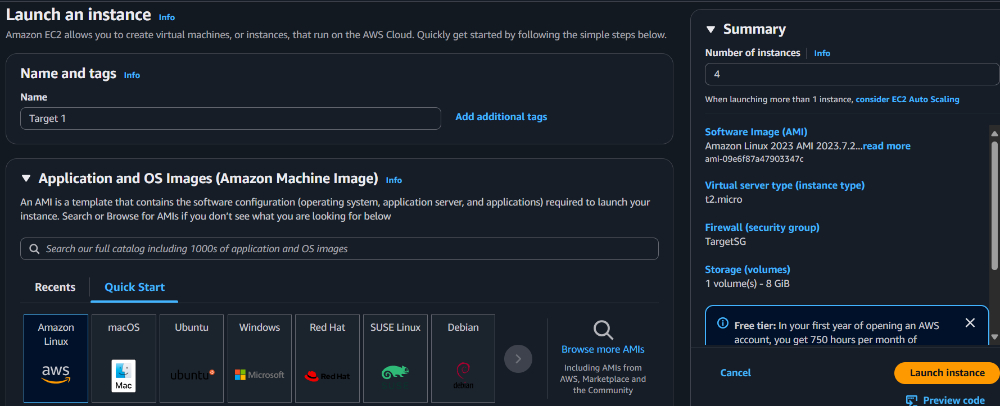
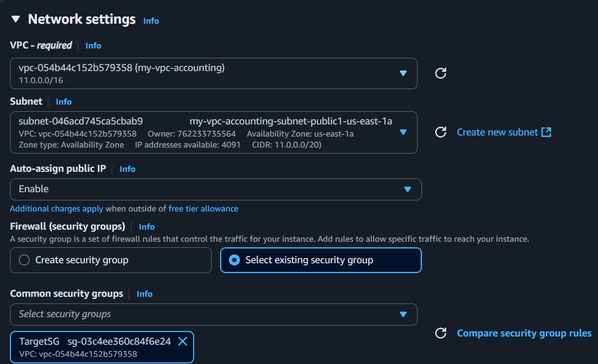
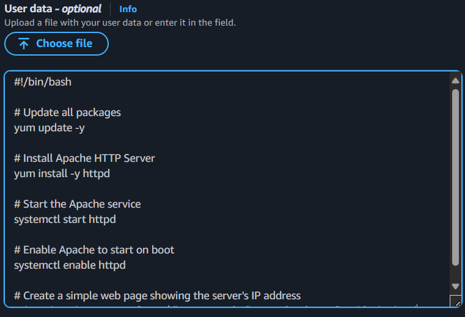
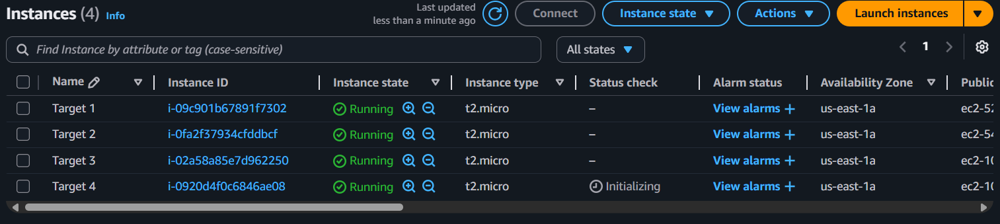
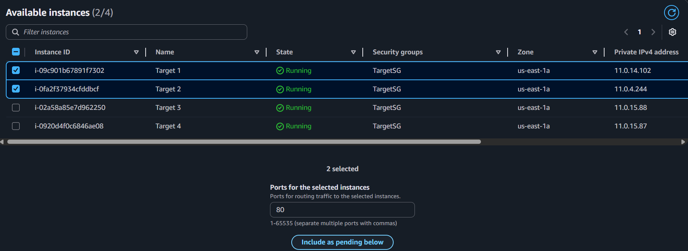
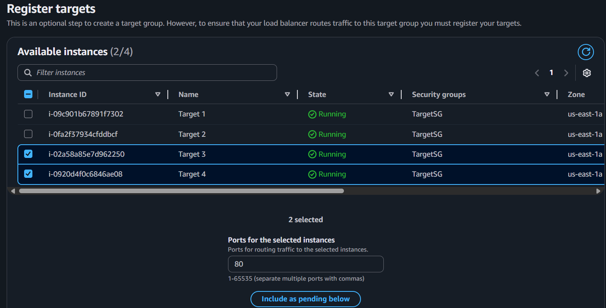
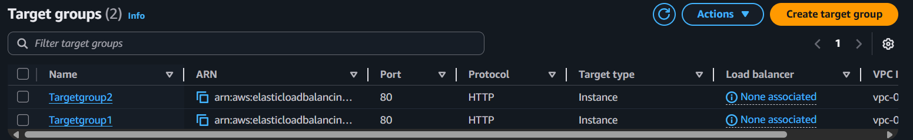
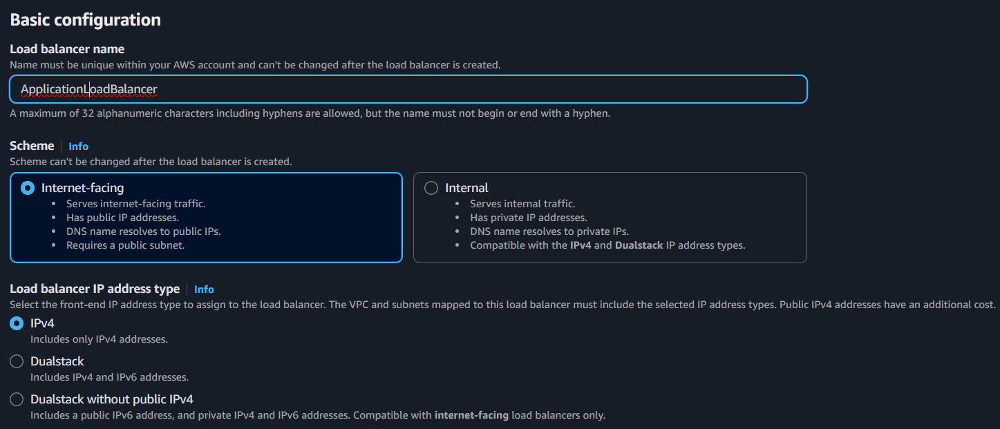
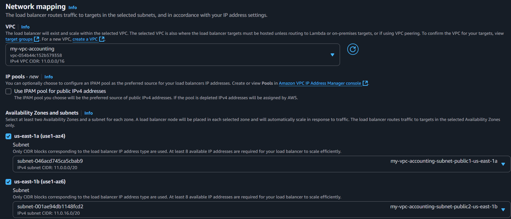

### Configure load balancer and listener
#### Setting up an application load balancer for two target groups:
##### Launch four instances
* Key pair is not needed


* Choose VPC, Subnets and Security group:


* Write a script in user data:


* Four instances are created:


---

##### Create target groups
* Create one target group:
```
Target type- Instances
Target group name- Targetgroup1
Protocol- HTTP
IP address type- IPv4
```
* Choose the VPC:
    * Choose the vpc in which our instances are running 
    * Remaining- default
* Register targets:
  * Select 2 instances→ Include as pending below→ Create target group:


* Create another target group:
```
Target type- Instances
Target group name- Targetgroup2
Protocol- HTTP
IP address type- IPv4
```
* Choose the VPC:
    * Choose the vpc in which our instances are running 
    * Remaining- default
* Register targets:
  * Select 2 instances→ Include as pending below→ Create target group:


* Two target groups have created:

---
##### Setting up an Application load balancer for two target groups
* Create Application load balancer:

* Choose VPC, Subnets and AZs:

* Add listeners and rules:
  * Add one listener rule


