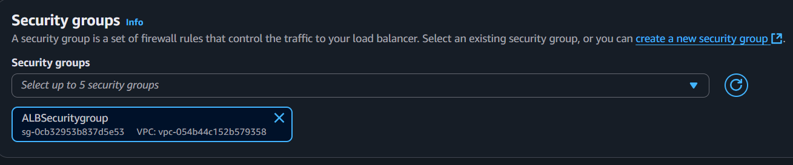
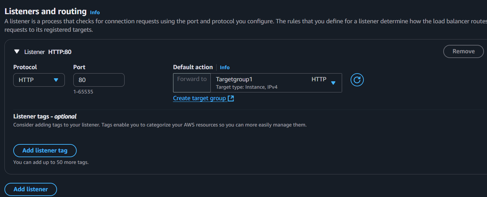
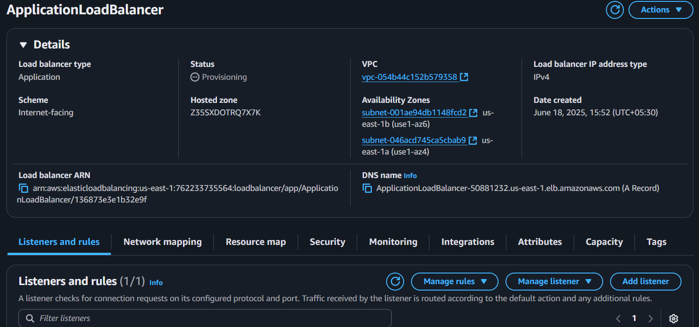
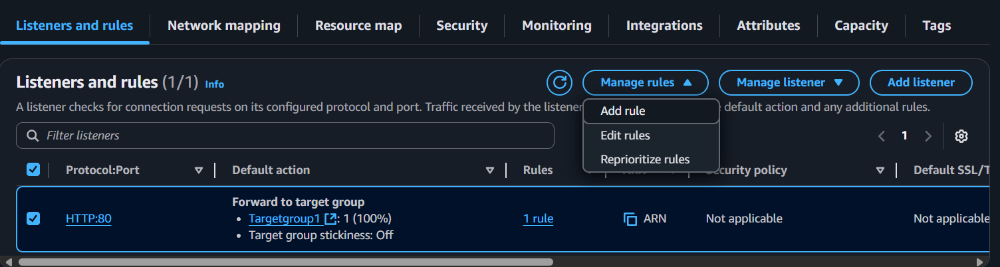
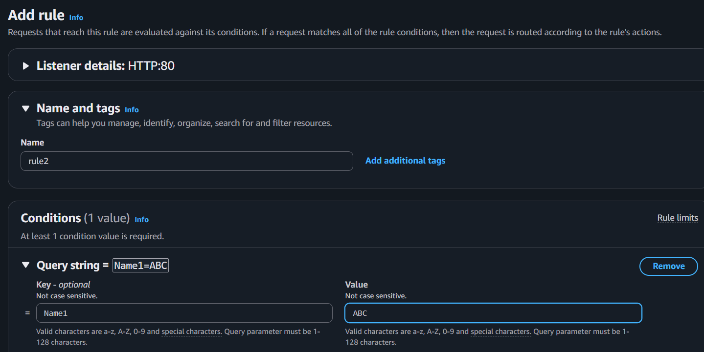
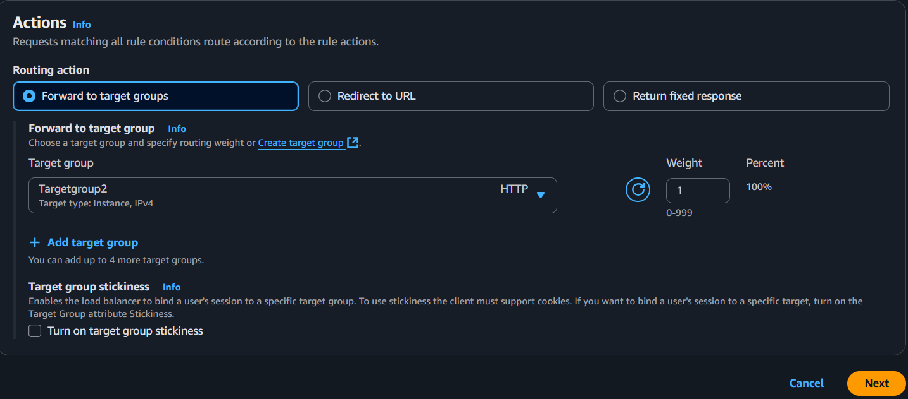
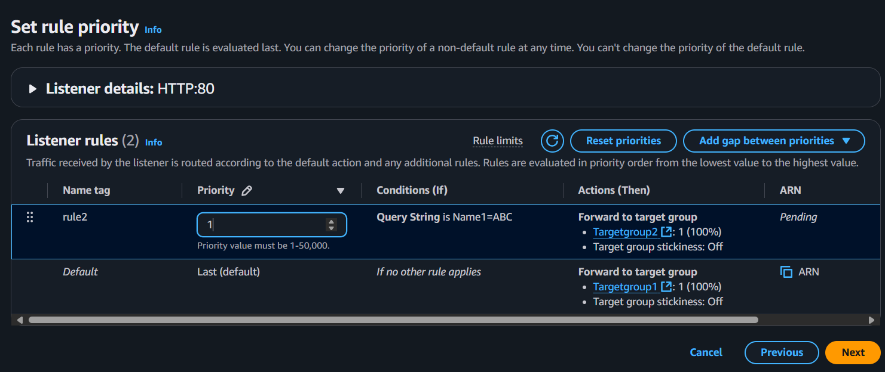
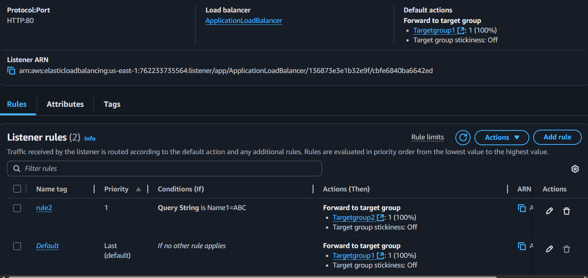
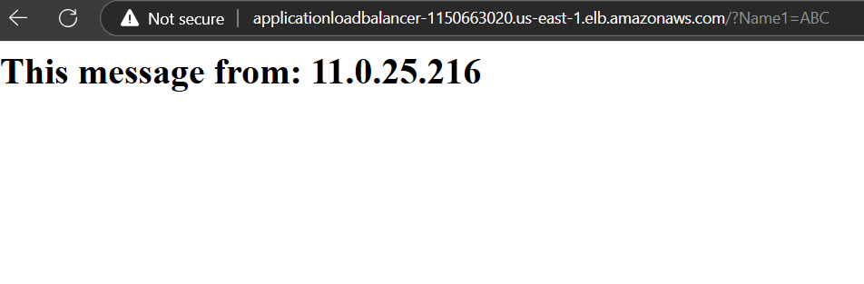

### Configuration of a load balancer and listener
#### Setting up an application load balancer for two target groups:
##### Launch four instances
   → Key pair is not needed


* Choose VPC, Subnets and Security group:


* Write a script in user data:


* Four instances are created:


---

##### Create target groups
* Create one target group:
```
Target type- Instances
Target group name- Targetgroup1
Protocol- HTTP
IP address type- IPv4
```
* Choose the VPC:
    * Choose the vpc in which our instances are running 
    * Remaining- default
* Register targets:
  * Select 2 instances→ Include as pending below→ Create target group:


* Create another target group:
```
Target type- Instances
Target group name- Targetgroup2
Protocol- HTTP
IP address type- IPv4
```
* Choose the VPC:
    * Choose the vpc in which our instances are running 
    * Remaining- default
* Register targets:
  * Select 2 instances→ Include as pending below→ Create target group:


* Two target groups have created:


---
##### Setting up an Application load balancer for two target groups
* Create Application load balancer:


* Choose VPC, Subnets and AZs:


* Add Security group:


* Add listener rule to Targetgroup1:


* Now Application load balancer has created


* Add one more rule:
  * Manage rules→ Add rule

  
* Add conditions:
  * Add condition→ Query string


* Forward requests to Targetgroup2:


* Set a priority for a rule2:


* Two rules are added:


* Copy the DNS name of our load balancer and paste it in URL:
    * Private IP addresses of Target1 and Target2 will be displayed means load balancer routes the traffic to Targetgroup1


* Load balancer will route the traffic to Targetgroup2 when Query string is used in the path


