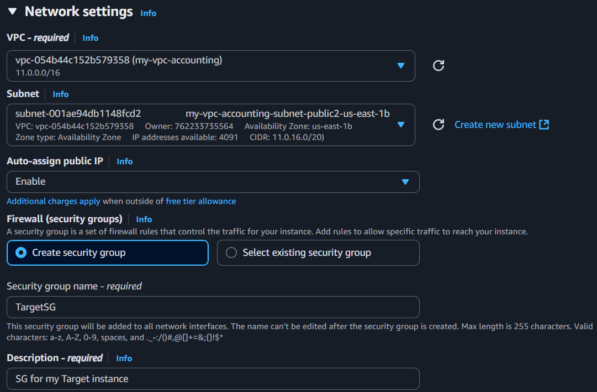
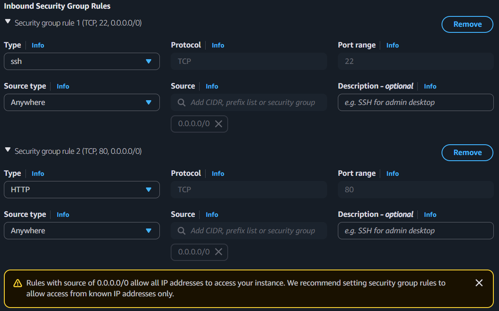
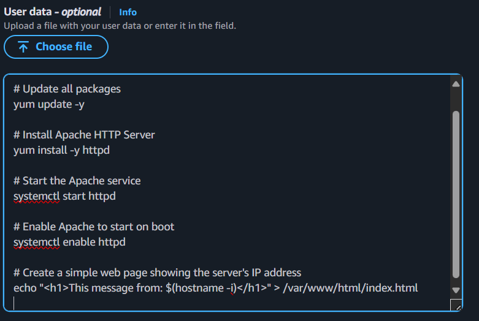
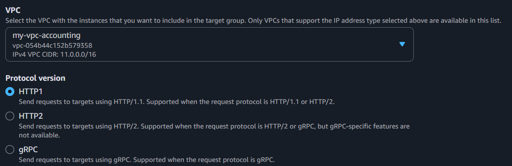
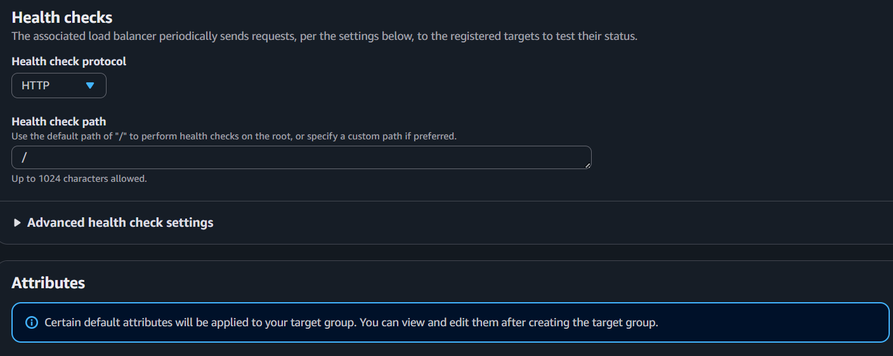
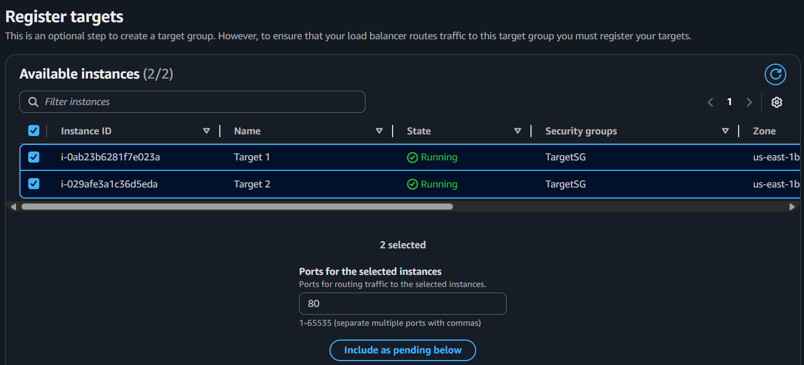
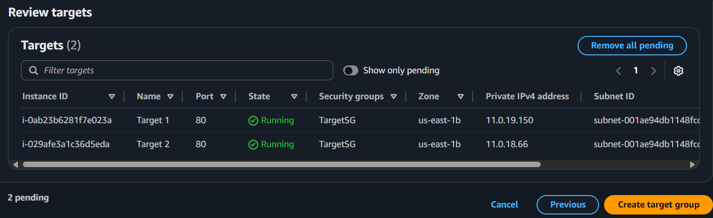

### Elastic load balancer
##### Create two instances


```commandline
AMI- Amazon Linux
instance type- t2.micro
key pair- Proceed without a key pair
```
##### Network settings
* Choose VPC, subnets and create security group:


* Allow inbound rules:


* Write a script in user data


```
#!/bin/bash

# Update all packages
yum update -y

# Install Apache HTTP Server
yum install -y httpd

# Start the Apache service
systemctl start httpd

# Enable Apache to start on boot
systemctl enable httpd

# Create a simple web page showing the server's IP address
echo "<h1>This message from: $(hostname -i)</h1>" > /var/www/html/index.html
```
##### Now launch the instances
* Two instances are created with a name Target 1 and Target 2
___
##### Create target groups
* EC2→ Target groups→ Create target group
```commandline
Target type- Instances
Target group name- TargetGroupTest
Protocol- HTTP
IP address type- IPv4
```
* Choose the VPC:
    * Choose the vpc in which our instances are running 
    * Remaining- default.



* Register targets:
  * Select 2 instances→ Include as pending below→ Create target group



