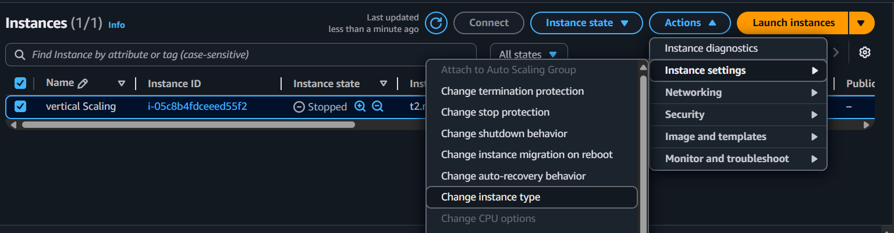
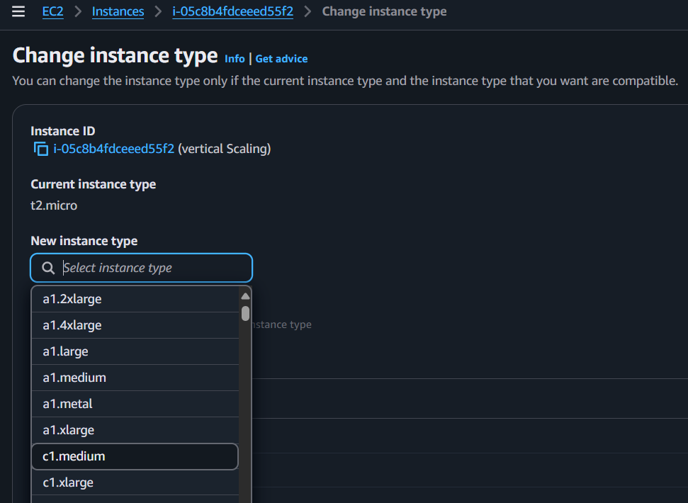

#### Vertical scaling
* Let's say I have an instance which is running; instance type- t2.micro and I want to change the instance type. We should stop the instance.
* Now go to Actions → Instance settings → new instance type (choose the instance type)- change

* Now we can start the instance.
