## IAM- Identity and Access Management
### Enabling MFA:
##### Login to AWS Console as a root user:
* Home- Security Credentials

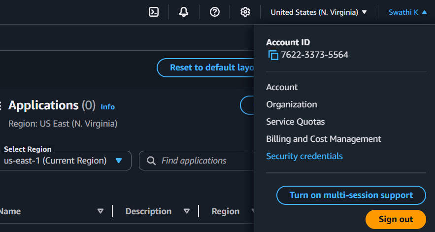

##### Assign MFA device:
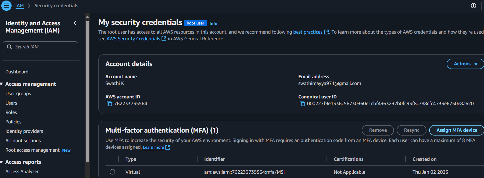

##### Selecting MFA device:
* Device name- OPPO-> MFA device options- Authenticator app- next
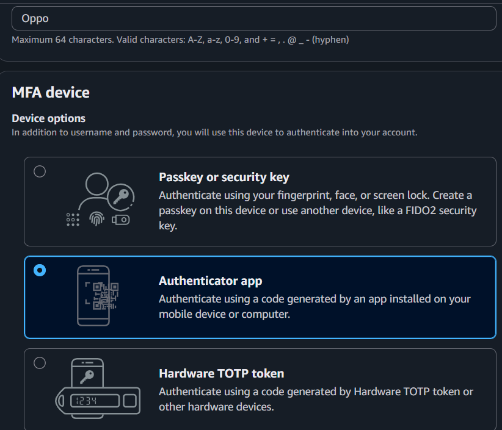
If you want to remove MFA device-> Home- Security Credentials- Assign MFA device- Passkeys and security keys- Remove.

##### Click See a list of compatible applications- Virtual authenticator apps (Do not click it)- it is just an information:
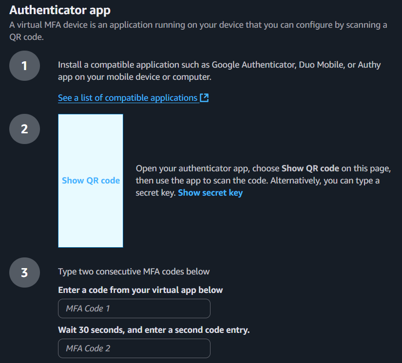
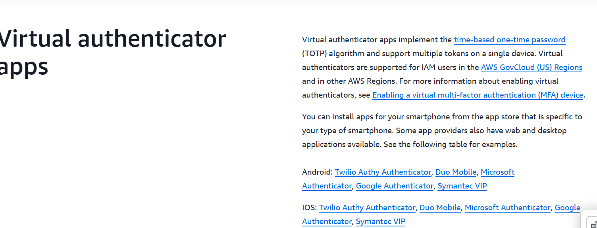

##### Set up device:
* Authenticator app- download the google app authenticator app in mobile- Open the app-> Click show QR code in laptop- scan the QR code using app- there is a 6-digit code after scanning in app- Enter the code in MFA Code 1 (Laptop)-> After 30 seconds you will see another code- enter it in MFA Code 2- Add MFA.
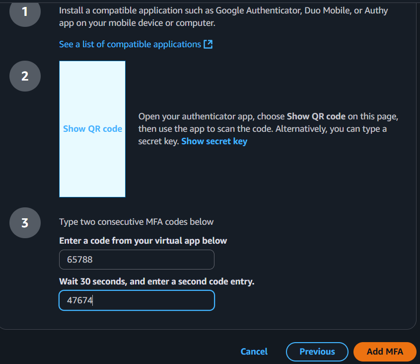

##### Sign in to the root user:
* Now sign-out from your account- Sign in to the root user- Enter email address- MFA Code- submit-> There is no problem if password or email address is leaked because MFA code is needed to sign in.
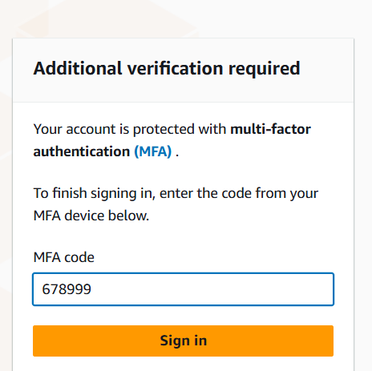

___

#### Creating IAM user account: 
* Creating IAM user account and granting administrative permissions to the user and login to the IAM user for day-to-day activities. You should be in root user.
##### Creating IAM User:
* IAM- users- create user.
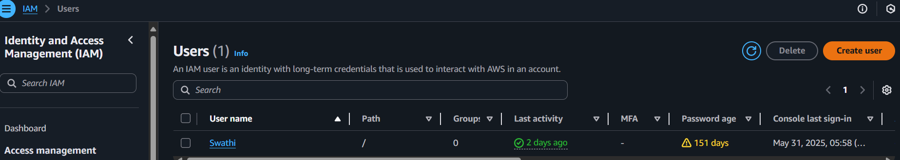

##### Specify User details:
* username- (testuser)- provide user access to aws console- Custom password-> disable the users must create a new password.
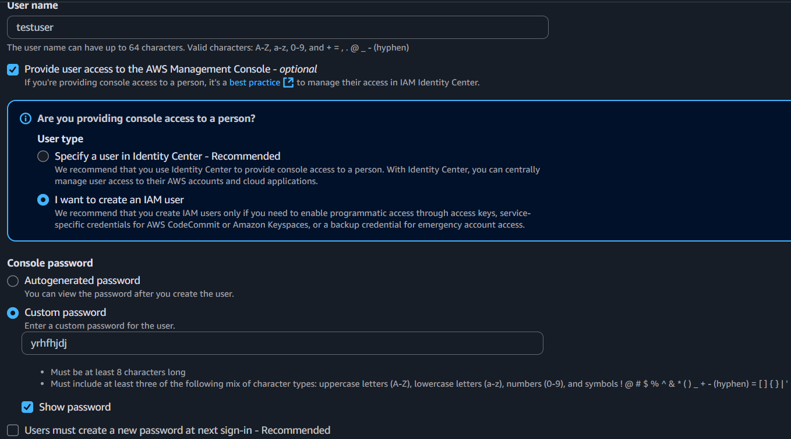

##### Set Permissions:
* Attach policy directly-> Permissions policies- AdministratorAccess- >next- >create user.
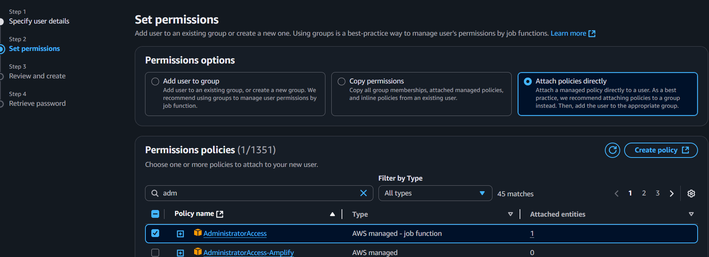

##### Logging in as IAM User:
* Now I have created IAM user and I want to practice lab by logging in as IAM user:
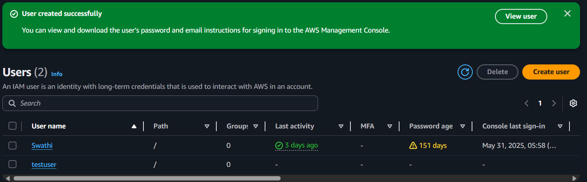

##### Sign in using an URL:
* You will see this page after creating IAM user Retrieve password-> copy the sign in URL- Sign out->Paste it in the new tab- Enter.
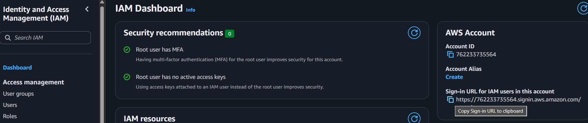
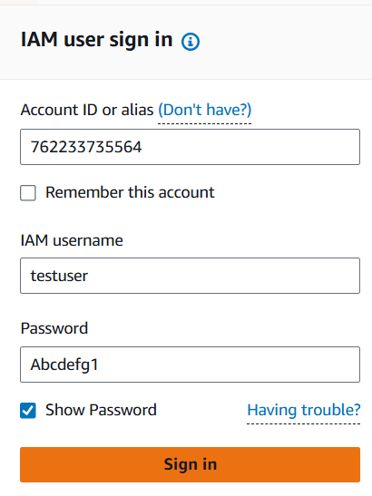

* IAM user sign in-> Account ID-> user name- (testuser) and password-> Now I have log in as IAM user and region should be North Virginia.
___

### IAM service
##### Specify user details:
* username- (testuser)- provide user access to aws console-Choose I want to create an IAM user- Autogenerated password-> enable the users must create a new password at next sign in.

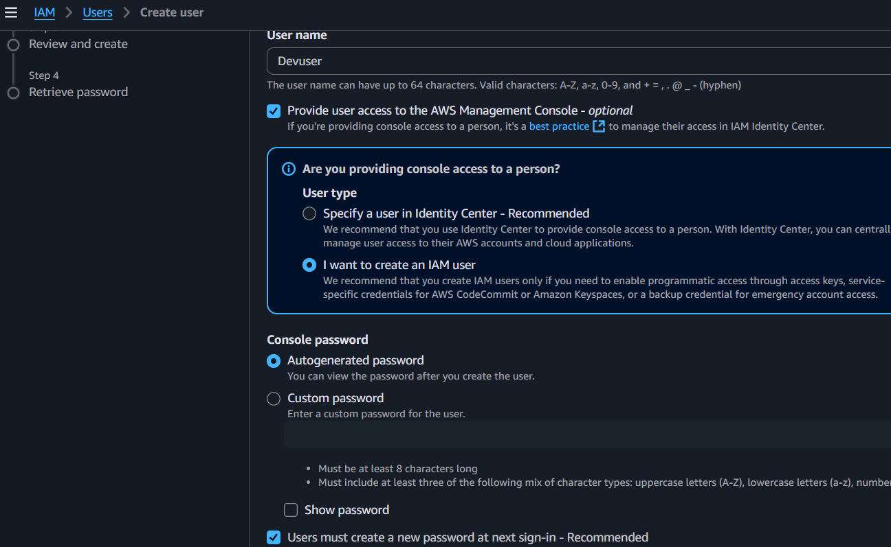

##### Set permissions:
* Select- attach policy directly- ec2fullaccess-next
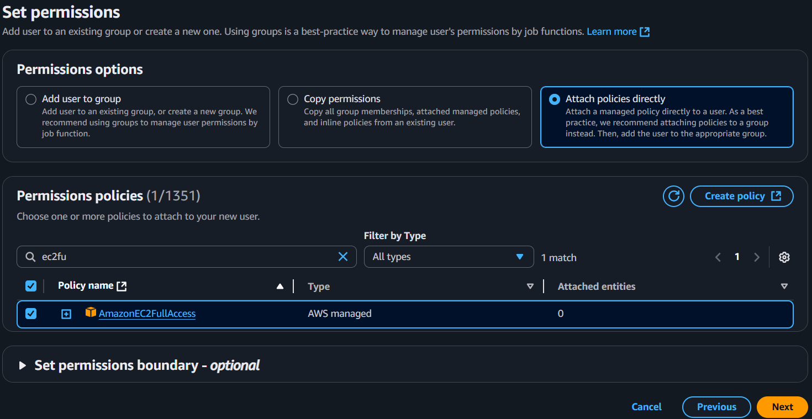

##### Review and create:
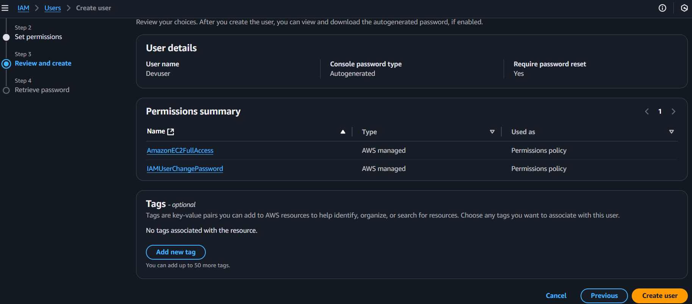

##### Retrieve Password:
* Copy the password-> copy the url-paste it in url

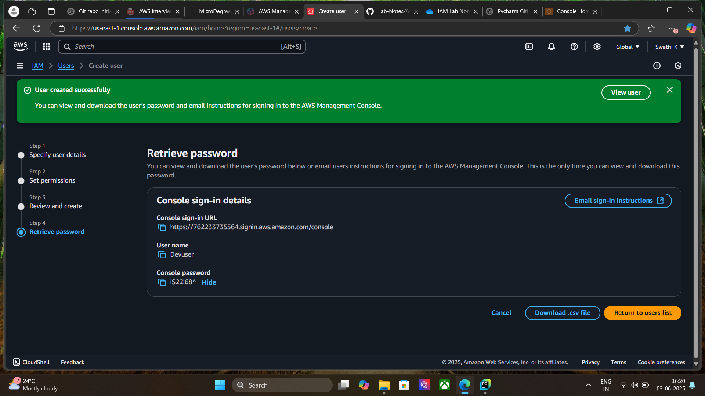

##### Login as Devuser:
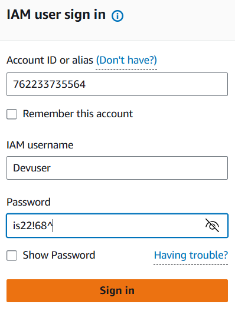

##### Set a newpassword:
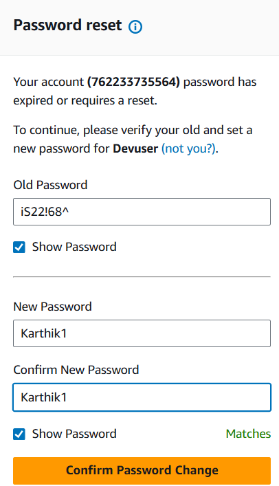

##### Logged in as Devuser:
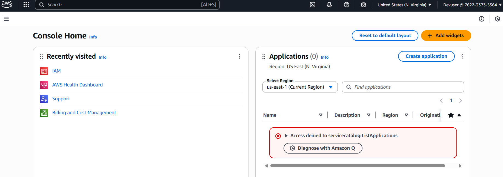

