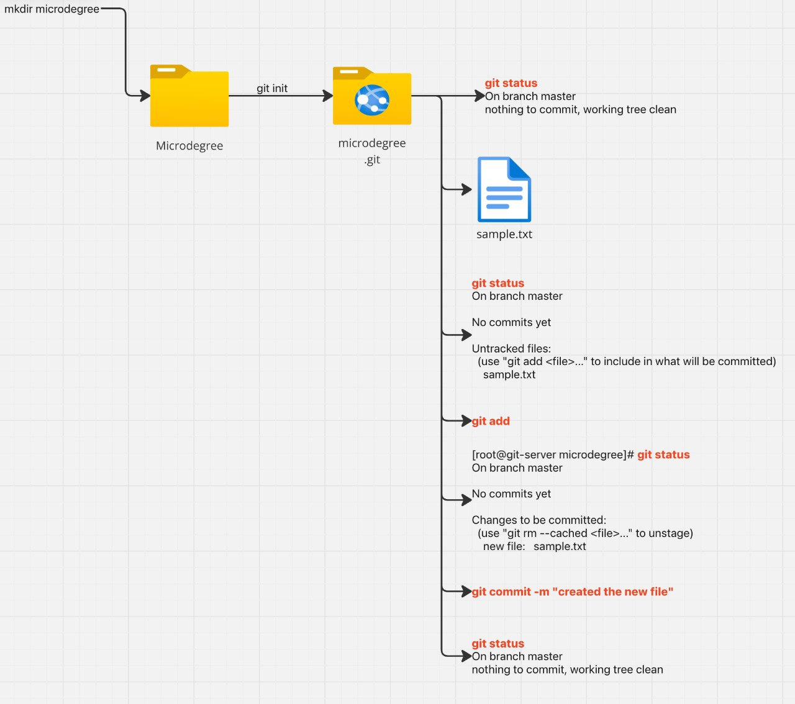
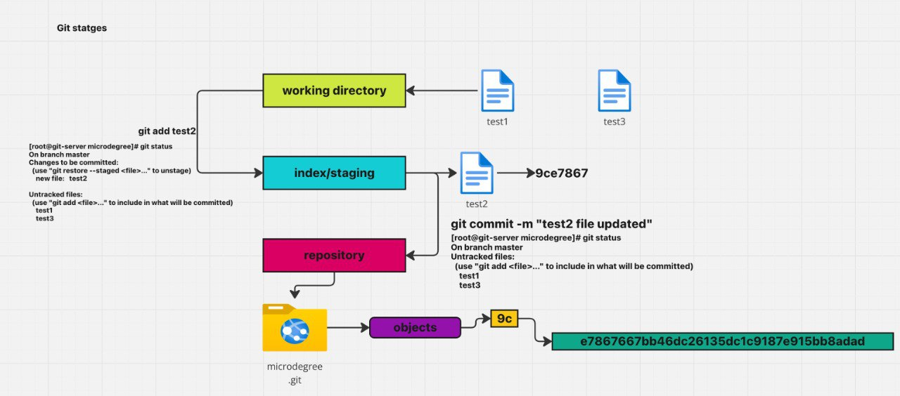

### Git Setup and First Commit Process

##### Checks if git command exists or not:
```commandline
[root@git-server ~]# git
```
##### If not install git:
```commandline
yum install git -y  # RHEL/CentOS
apt install git     # Debian/Ubuntu
```
##### Create a New Folder:
```commandline
mkdir microdegree 
cd microdegree/ 
```
#####  Initialize a Git Repository:
```commandline
git init
```
→ This creates a .git/ folder and makes it a local Git repository
##### Create a File:
```commandline
touch sample.txt 
```
##### Check File Status:
```commandline
git status
```
→ You’ll see the file is untracked
##### Add File to Staging Area:
```commandline
git add sample.txt
```
→ File is now staged for commit.
##### Commit the File:
```commandline
git commit -m "Initial commit: added sample.txt"
```
##### Configure Git:
```commandline
git config --global user.name "Your Name"
git config --global user.email "you@example.com"
```
→ This sets your identity for all your commits.
##### Check Commit History:
```commandline
git log --oneline
```
* The git log -p command is used to show the commit history along with the changes (diffs) introduced in each commit:
```commandline
git log –p 
```
* Show the commit history of your Git repository — starting from the most recent commit:
```commandline
git log 
```
---


