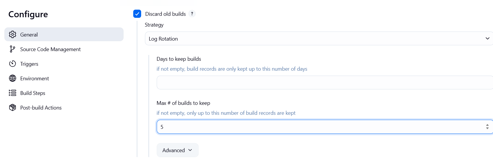
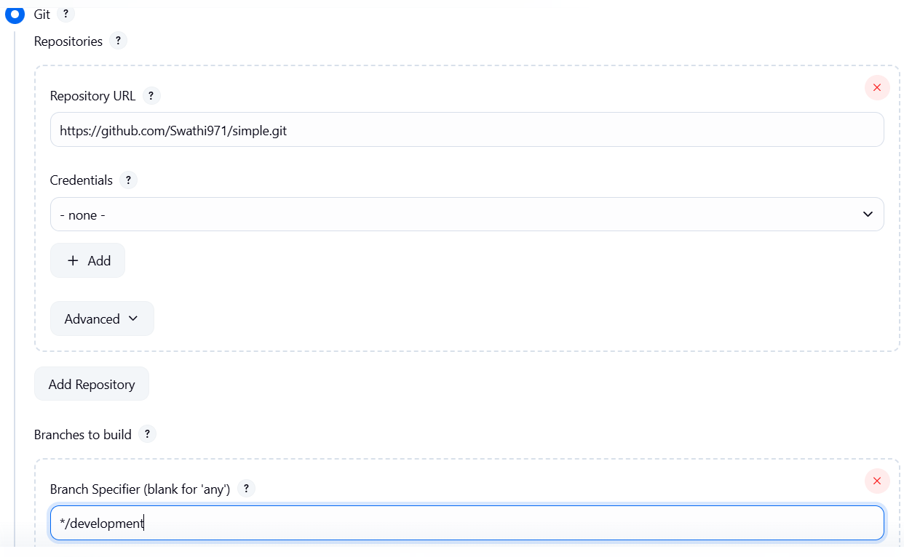
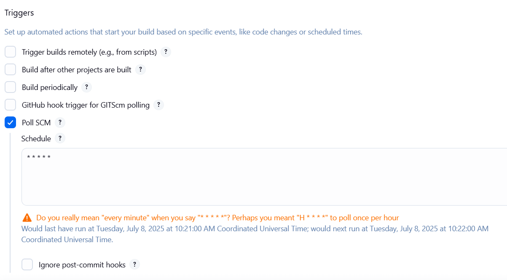
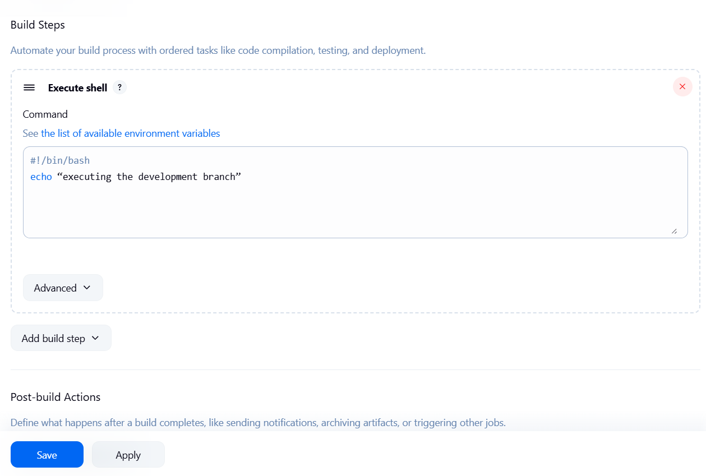
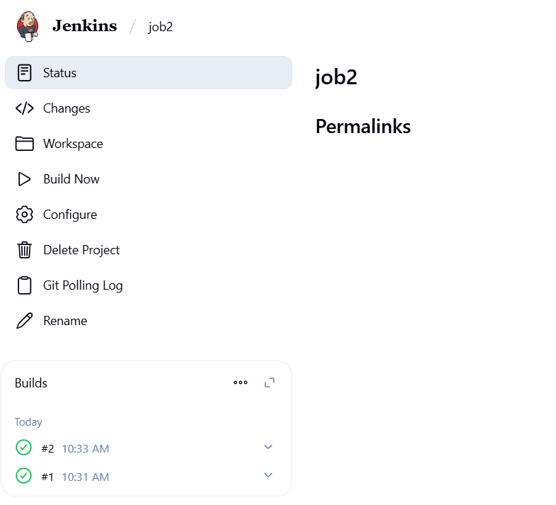

#### Simple freestyle project
##### Create a new Job
* Now, we are creating the jobs in freestyle
* Click on create a job (or) new item→ Enter task name→ click on freestyle project
* Build→ Execute shell
```
#!/bin/bash
uptime
date 
```
* Apply→ Save→ Build now
---
#### Creating freestyle project(Build periodically)
* Go to Dashboard→ test1→ Configuration→ General


*  Get the Git Repo
   * Copy the github repo url and paste in under SCM. It is showing error
   * So, now in your AWS terminal → Install GIT → yum install git -y 
   * Whenever we are using private repo, then we have to create credentials. But right now, we are using 
public repo. So, none credentials

   
   *  If we want to get the data from particular branch means you can mention the branch name in branch 
section.But default it takes master

   
   * Triggers

   
   * Click on save and Build now and build success


* If you want to see output in jenkins. Click on console output i.e., (click green tick mark)
* If you want to see the repo in our linux terminal:
   * Go to this path →  cd /var/lib/jenkins/workspace/task_name  ⟶ now you can see the files from git repo


  * If we edit the data in github, then again we have to do build, otherwise that change didn’t reflect in 
linux server
  * Once run the build, open the file in server whether the data is present/not
  * So, if we’re doing like this means this is completely under manual work. But, we are DevOps 
engineers we need automatically.

**Note**: Here changes ‘happen/not’ automatically build will happen in “schedule the jobs”

---
#### Creating freestyle project(Poll SCM)
* It only works whenever the changes happened in “GIT” tool (or) github
Dashboard→ new item→ test2→ Frees style→ OK




* I have made changes in development branch
* Now we can see the builds
