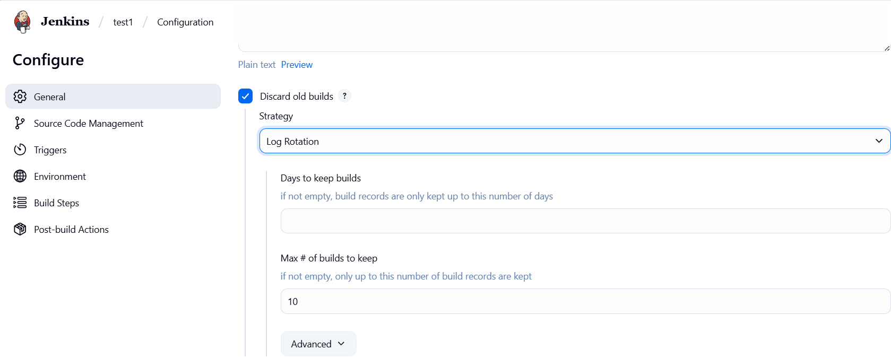
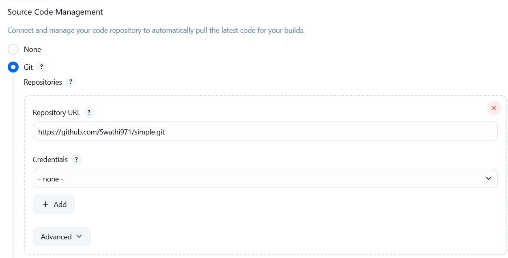
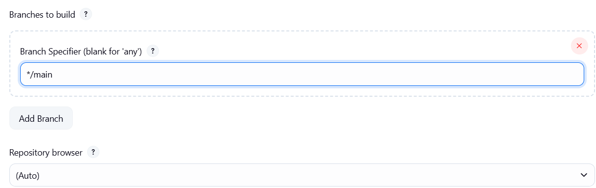
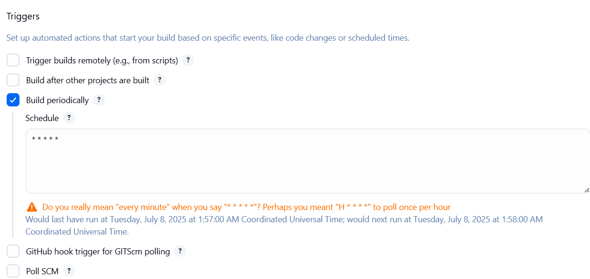
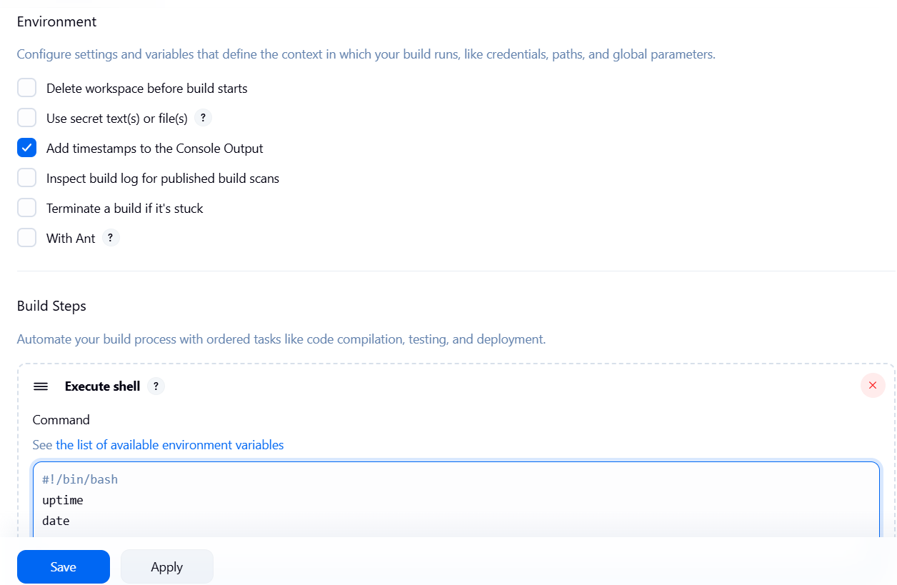
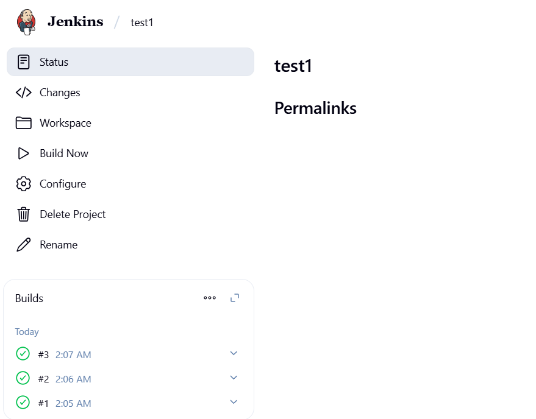
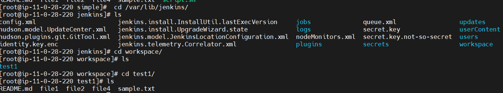

#### Simple freestyle project
##### Create a new Job
* Now, we are creating the jobs in freestyle
* Click on create a job (or) new item→ Enter task name→ click on freestyle project
* Build→ Execute shell
```
#!/bin/bash
uptime
date 
```
* Apply→ Save→ Build now
---
##### Creating freestyle project(Build periodically)
* Go to Dashboard→ test1→ Configuration→ General


*  Get the Git Repo
   * Copy the github repo url and paste in under SCM. It is showing error
   * So, now in your AWS terminal → Install GIT → yum install git -y 
   * Whenever we are using private repo, then we have to create credentials. But right now, we are using 
public repo. So, none credentials

   
   *  If we want to get the data from particular branch means you can mention the branch name in branch 
section.But default it takes master

   
   * Trigger

   
   * Click on save and Build now and build success



