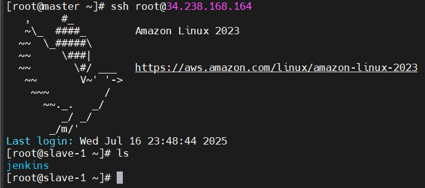
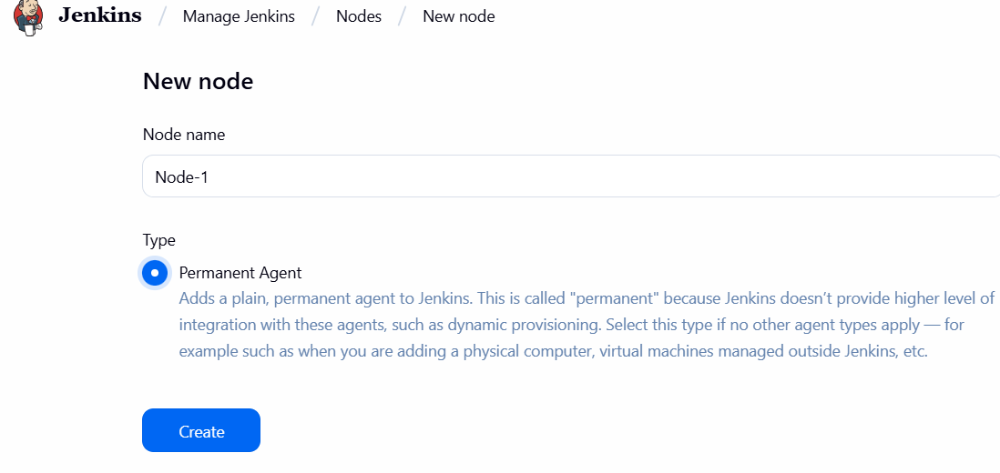
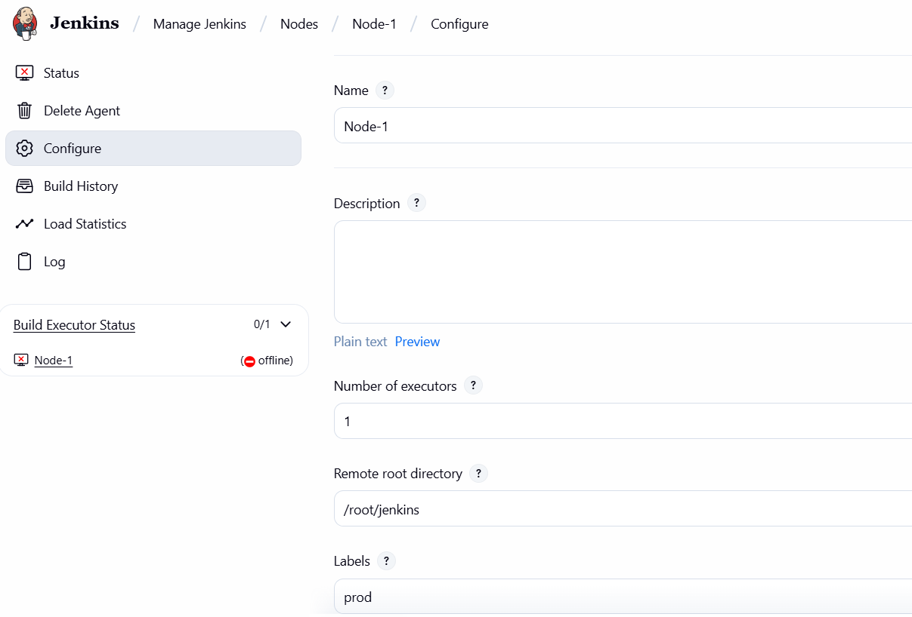
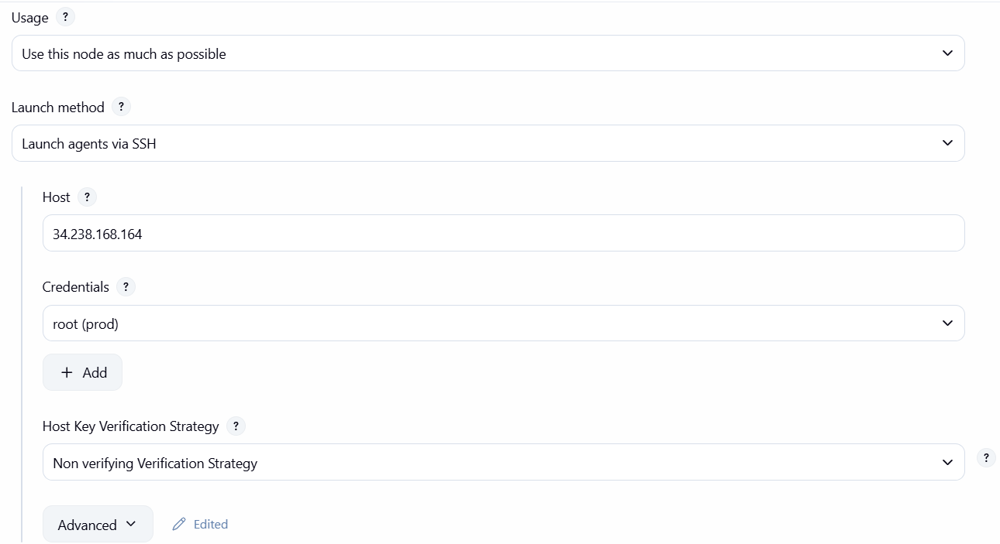
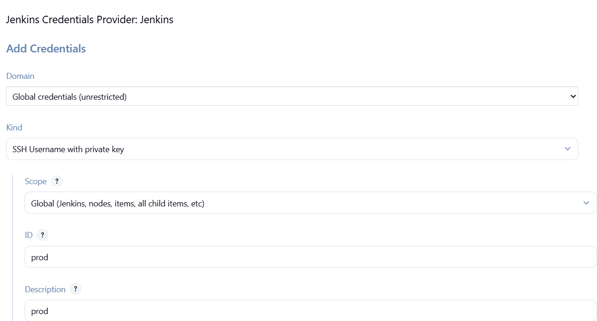
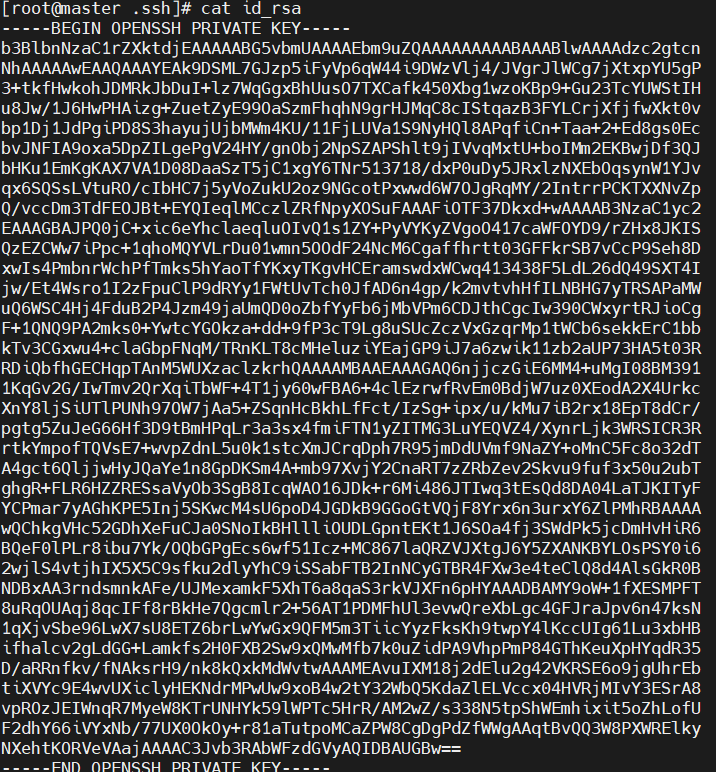
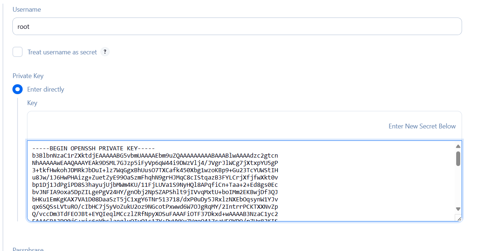
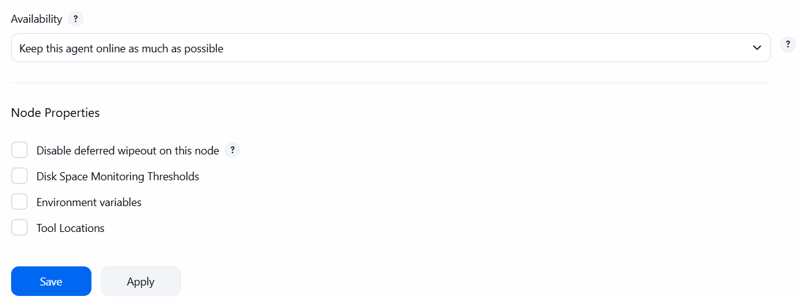

### Jenkins Master-Slave Configuration
##### Now we will see how connectivity works between master and slave

##### Setup for Master & Slave
1. Launch 3 instances with key-pair, because for server to server communication we are using 
key-pair 

a. Here name the 3 instances like master, slave-1, slave-2 for better understanding

b. In master server do jenkins setup

c. In slave servers you have to install one dependency i.e., java. 

d. Here, in master server whatever the java version you installed right, same you have to install the 
same version in slave server

##### Install Jenkins Master
* Launch an instance called master- t2.medium- 20GB-> install the jenkins-> connect to the jenkins using public IP.  
```
[root@ip-11-0-0-37 ~]# hostname master 
[root@ip-11-0-0-37 ~]# bash 
```
```
[root@master ~]# vi script.sh
```
```
#!/bin/bash
#This works only on Linux or redhat
sudo wget -O /etc/yum.repos.d/jenkins.repo \
        https://pkg.jenkins.io/redhat/jenkins.repo
sudo rpm --import https://pkg.jenkins.io/redhat/jenkins.io-2023.key
sudo yum upgrade
# Add required dependencies for the jenkins package
sudo yum install fontconfig java-17 -y
sudo yum install jenkins -y
sudo systemctl daemon-reload
# Start Jenkins
sudo systemctl enable jenkins
sudo systemctl start jenkins
sudo systemctl status jenkins
```
* Launch an instance called slave-1- t2.meduim- 10 GB-> connect directly in UI- hostname –slave-1
```
[ec2-user@slave-1 ~]$ sudo su -
[root@slave-1 ~]# 
[root@slave-1 ~]# mkdir jenkins 
[root@slave-1 ~]# ls 
Jenkins 
[root@slave-1 ~]# realpath jenkins/ 
/root/jenkins
```
* Launch an instance called slave-2- t2.micro- 8gb storage- launch instance – Connect – Ec2 instance Connect-> Username- root(I am directly log in to root)- connect. 
```commandline
[root@ip-123-34-45-56 ~]# hostname slave-2 
[root@ip-123-34-45-56 ~]# bash 
[root@slave-2~]# yum install java –y 
[root@slave-2~]# java --version  
[root@slave-2~]# mkdir Jenkins   # we can create any folder 
[root@slave-2~]# ls 
Jenkins 
[root@slave-2~]# realpath Jenkins 
/root/Jenkins 
```
#### Now I want to make connectivity establishment from master node to slave nodes:
##### Connecting to slave-1 node:
* Paste the public Ip address of the slave-1 node:
```commandline
[root@master ~]#  ssh root@54.242.215.195 
Permission denied
```
No communication from master node to slave node:

* Generate a ssh key:
```
[root@master ~]# cd .ssh/   
[root@master .ssh]# ssh-keygen
[root@master .ssh]# ls  
[root@master .ssh]# cat id_rsa.pub 
```
* Copy the public key and go to slave-1 node:
```commandline
[root@slave-1 ~]# cd .ssh/  
[root@slave-1 .ssh]# ls  
authorized_keys  
[root@slave-1 .ssh]# vi authorized_keys 
```
Press O -> cursor come to new line with insert-> then paste it; I have mentioned the public key in a authorised_keys

* Now run again: 
```
[root@master ~]#  ssh root@54.242.215.195 
```

Now I am able to connect from the master node to the slave node. 

##### Connecting to slave-2 node:
* Generate ssh-key in master node:
```commandline
[root@master ~]# cd .ssh/   
[root@master .ssh]# ssh-keygen
[root@master .ssh]# ls  
[root@master .ssh]# cat id_rsa.pub
```
* Copy the public key and go to slave-2 node:
```commandline
[root@slave-1 ~]# cd .ssh/  
[root@slave-1 .ssh]# ls  
authorized_keys  
[root@slave-1 .ssh]# vi authorized_keys 
```
* Run:
```commandline
[root@master.ssh]# ssh root@ public ip address of slave node
```
Now master node is connected to slave-2 node.

2. Open Jenkins-master server and do setup
##### Now we will build the connectivity: 
* Go to manage jenkins → Nodes → click on new node → Node name: Node-1 → click on 
permanent agent and create


*  Number of executors - 1

*  Remote root directory 
     * We have to give slave server path. Here, jenkins related information stored here

 So, on that remote path jenkins folder created. we can see build details, workspace, etc..,

*  Labels - 
Labels- prod 

* Usage – use this node as much as possible. 


*  Launch method -  Launch agents via SSH

* Host- public Ip of slave node. 

* Credentials- add- jenkins







