### Jenkins Master-Slave Configuration
##### Now we will see how connectivity works between master and slave

##### Setup for Master & Slave
1. Launch 3 instances with key-pair, because for server to server communication we are using 
key-pair 

a. Here name the 3 instances like master, slave-1, slave-2 for better understanding

b. In master server do jenkins setup

c. In slave servers you have to install one dependency i.e., java. 

d. Here, in master server whatever the java version you installed right, same you have to install the 
same version in slave server

##### Install Jenkins Master
* Launch an instance called master- t2.medium- 20GB-> install the jenkins-> connect to the jenkins using public IP.  
```
[root@ip-11-0-0-37 ~]# hostname master 
[root@ip-11-0-0-37 ~]# bash 
```
```
[root@master ~]# vi script.sh
```
```
#!/bin/bash
#This works only on Linux or redhat
sudo wget -O /etc/yum.repos.d/jenkins.repo \
        https://pkg.jenkins.io/redhat/jenkins.repo
sudo rpm --import https://pkg.jenkins.io/redhat/jenkins.io-2023.key
sudo yum upgrade
# Add required dependencies for the jenkins package
sudo yum install fontconfig java-17 -y
sudo yum install jenkins -y
sudo systemctl daemon-reload
# Start Jenkins
sudo systemctl enable jenkins
sudo systemctl start jenkins
sudo systemctl status jenkins
```
* Launch an instance called slave-1- t2.meduim- 10 GB-> connect directly in UI- hostname –slave-1
```
[ec2-user@slave-1 ~]$ sudo su -
[root@slave-1 ~]# 
[root@slave-1 ~]# mkdir jenkins 
[root@slave-1 ~]# ls 
Jenkins 
[root@slave-1 ~]# realpath jenkins/ 
/root/jenkins
```
* Launch an instance called slave-2- t2.micro- 8gb storage- launch instance – Connect – Ec2 instance Connect-> Username- root(I am directly log in to root)- connect. 
```commandline
[root@ip-123-34-45-56 ~]# hostname slave-2 
[root@ip-123-34-45-56 ~]# bash 
[root@slave-2~]# yum install java –y 
[root@slave-2~]# java --version  
[root@slave-2~]# mkdir Jenkins   # we can create any folder 
[root@slave-2~]# ls 
Jenkins 
[root@slave-2~]# realpath Jenkins 
/root/Jenkins 
```
#### Now I want to make connectivity establishment from master node to slave nodes:
##### Connecting to slave-1 node:
* Paste the public Ip address of the slave-1 node:
```commandline
[root@master ~]#  ssh root@54.242.215.195 
Permission denied
```
No communication from master node to slave node:

* Generate a ssh key:
```
[root@master ~]# cd .ssh/   
[root@master .ssh]# ssh-keygen
[root@master .ssh]# ls  
[root@master .ssh]# cat id_rsa.pub 
```
* Copy the public key and go to slave-1 node:
```commandline
[root@slave-1 ~]# cd .ssh/  
[root@slave-1 .ssh]# ls  
authorized_keys  
[root@slave-1 .ssh]# vi authorized_keys 
```
Press O -> cursor come to new line with insert-> then paste it; I have mentioned the public key in a authorised_keys

* Now run again: 
```
[root@master ~]#  ssh root@54.242.215.195 
```

Now I am able to connect from the master node to the slave node. 

##### Connecting to slave-2 node:
* Generate ssh-key in master node:
```commandline
[root@master ~]# cd .ssh/   
[root@master .ssh]# ssh-keygen
[root@master .ssh]# ls  
[root@master .ssh]# cat id_rsa.pub
```
* Copy the public key and go to slave-2 node:
```commandline
[root@slave-1 ~]# cd .ssh/  
[root@slave-1 .ssh]# ls  
authorized_keys  
[root@slave-1 .ssh]# vi authorized_keys 
```
* Run:
```commandline
[root@master.ssh]# ssh root@ public ip address of slave node
```
Now master node is connected to slave-2 node.

2. Open Jenkins-master server and do setup
##### Now we will build the connectivity: 
* Go to manage jenkins → Nodes → click on new node → Node name: Node-1 → click on 
permanent agent and create

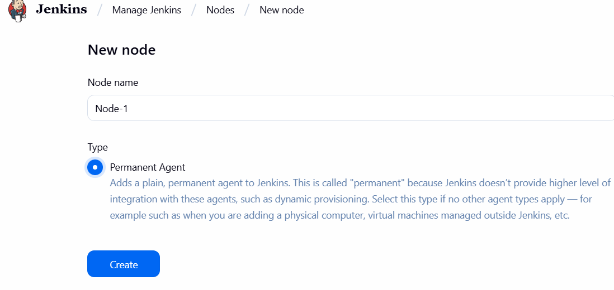

*  Number of executors - 1

*  Remote root directory 
     * We have to give slave server path. Here, jenkins related information stored here


 So, on that remote path jenkins folder created. we can see build details, workspace, etc..,

*  Labels - 
Labels- prod 

* Usage – use this node as much as possible.
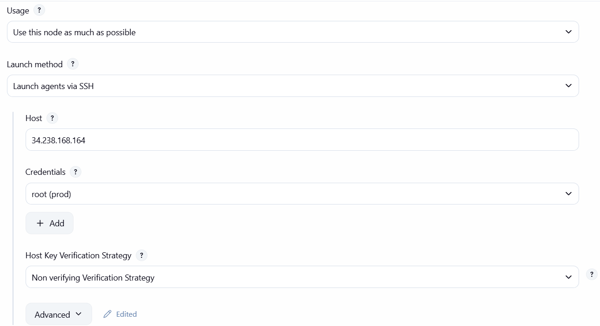

*  Launch method -  Launch agents via SSH

* Host- public Ip of slave node. 

* Credentials- add- jenkins


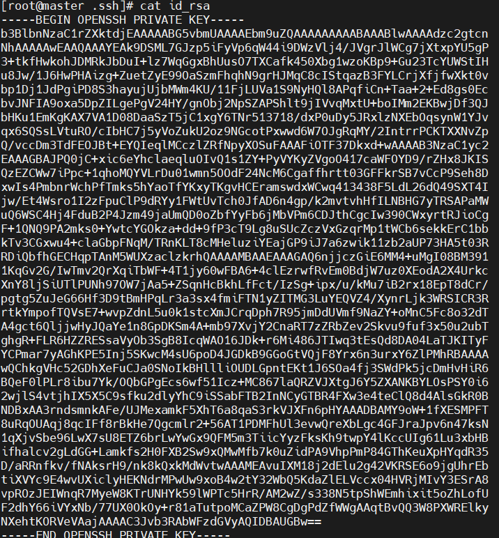

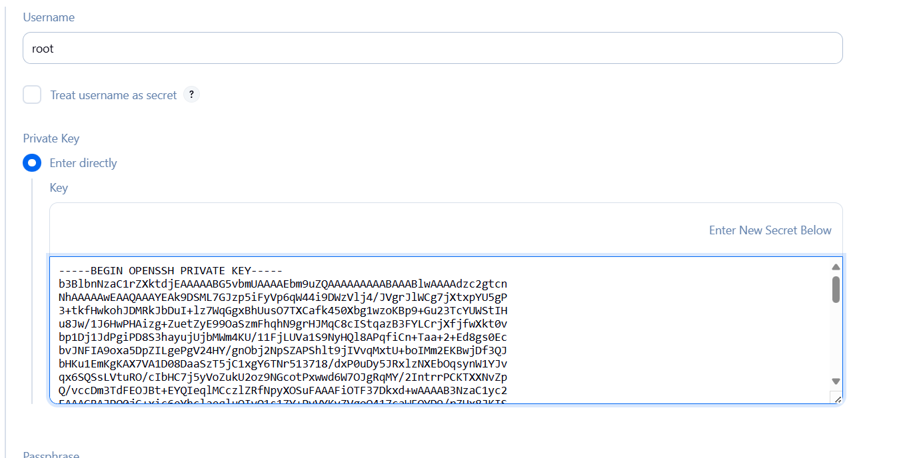


`````
 
`````
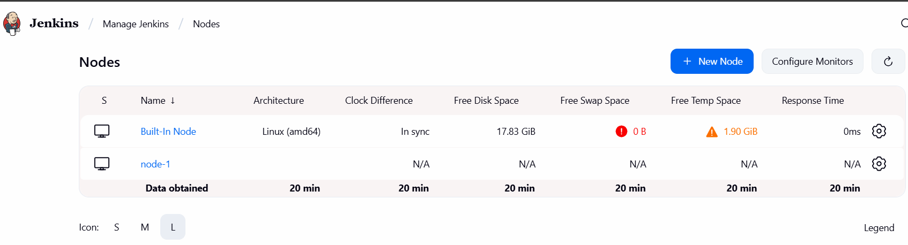

we are sucessfully connected node-1:


Connecting to slave-2:
launch another instance called slave-2

create another node:


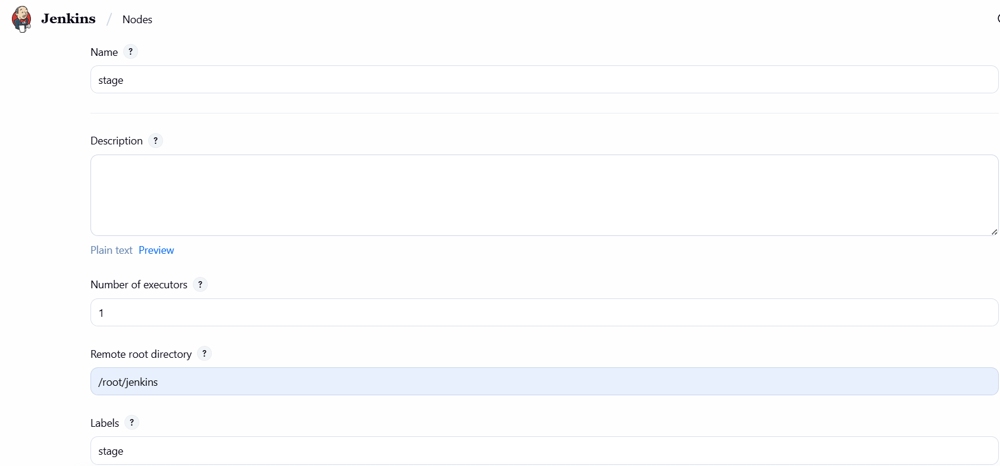


Now see logs:


Successfully connected to stage node.


Change the configuration in prod node:

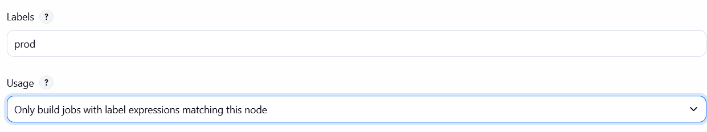

Now we will create freestyle project:

Configure:


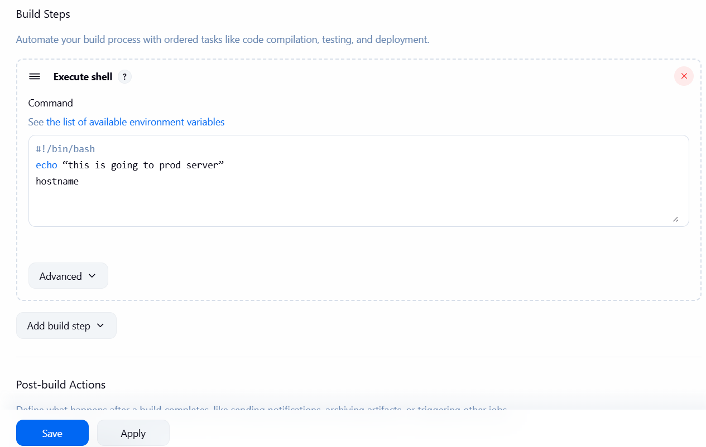

Build now:
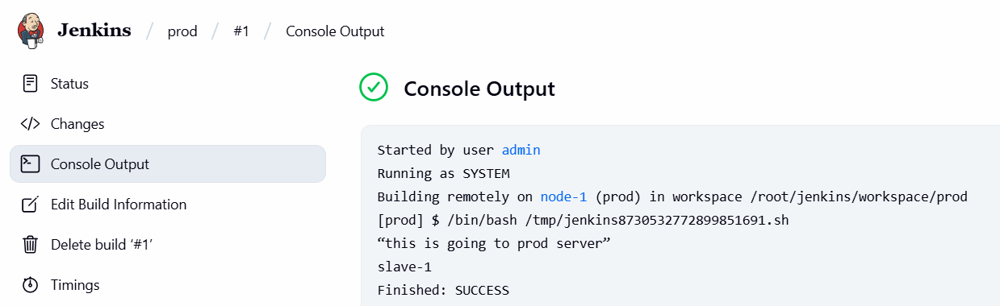

Connectivity establishes from master to slave via remoting.jar:


prod has ran in workspace:

---
create project-stage:
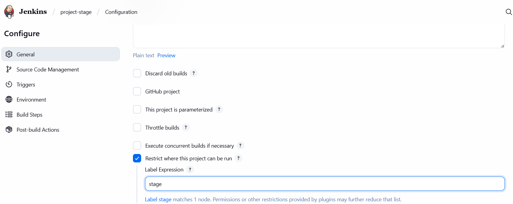
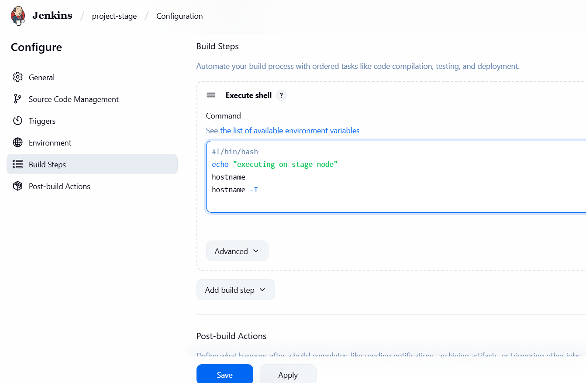

Apply- save -build now

now go to stage environment:
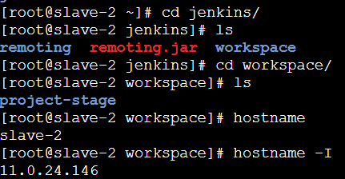
Now got to jenkins-> console output of stage job-> slave-2 and public Ip address of slave-2 wil; be there:
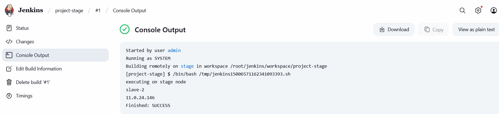

Now go to master environment:
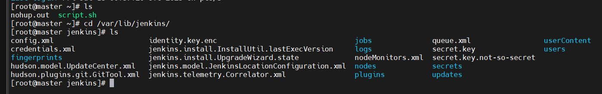
Workspace is not created - because we have not scheduled any job in master node instead  

I scheduled the jobs in respected slave nodes whether it is stage or prod. 

Now create pipeline script: test1
```
pipeline {
    agent {
        label "prod"
    tools{
        maven 'maven'
        jdk 'java-11'
    }

    stages {
        stage('git-checkout') {
            steps {
                git branch: 'main', url: 'https://github.com/Swathi971/trail.git'
            }
        }

        stage('compile') {
            steps {
                sh 'mvn compile'
            }
        }

        stage('build') {
            steps {
                sh 'mvn clean package'
            }
        }
    }
}
```


it is building on prod node:


go to console output, it shows some error:


install git in slave-1:
```commandline
[root@slave-1 ~]# yum install git -y
```

again build:
go to console output- Sucess

Now go to slave-1 environment:


Let’s say I won't define anything: 
Create test2 project:


Click on schedule a build for test2:


Go to console output:


go to built-in node:
Configuration:


Now chnage the configuration:
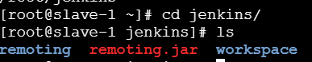

again build the test2:
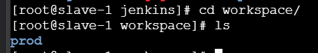
now it is building on stage

create test3:
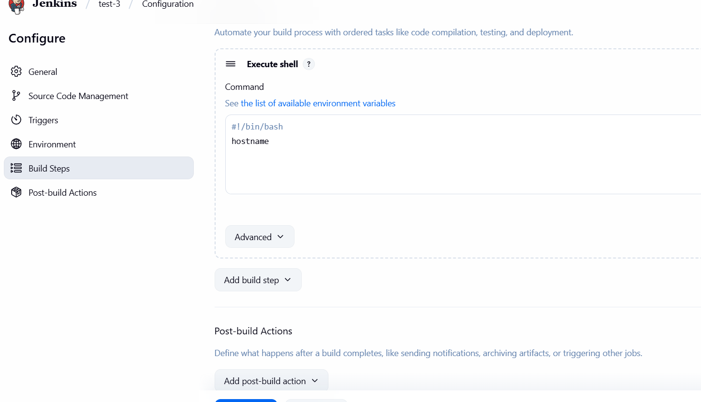


it is going to stage node why?

