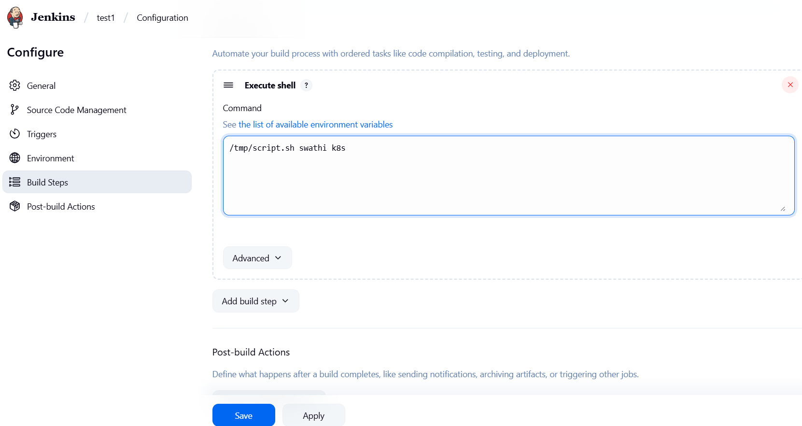
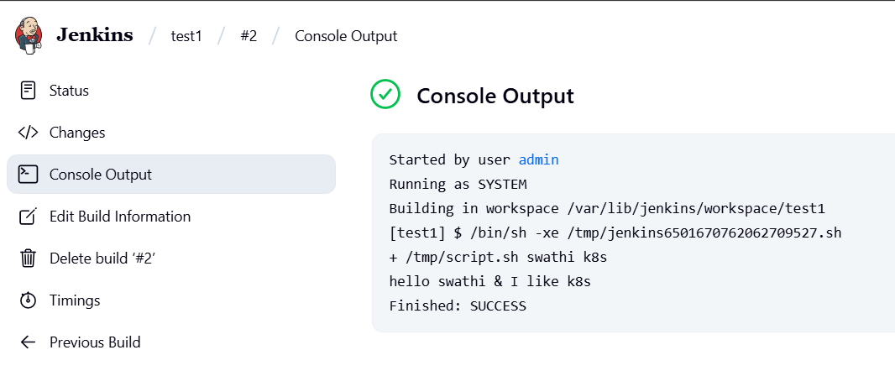
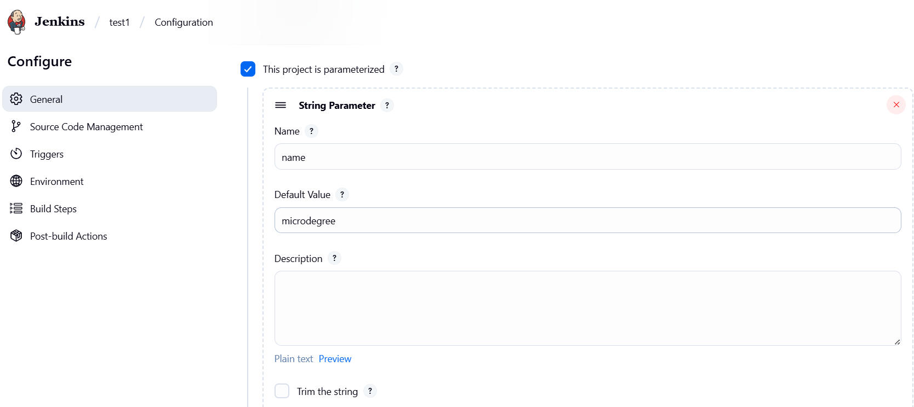
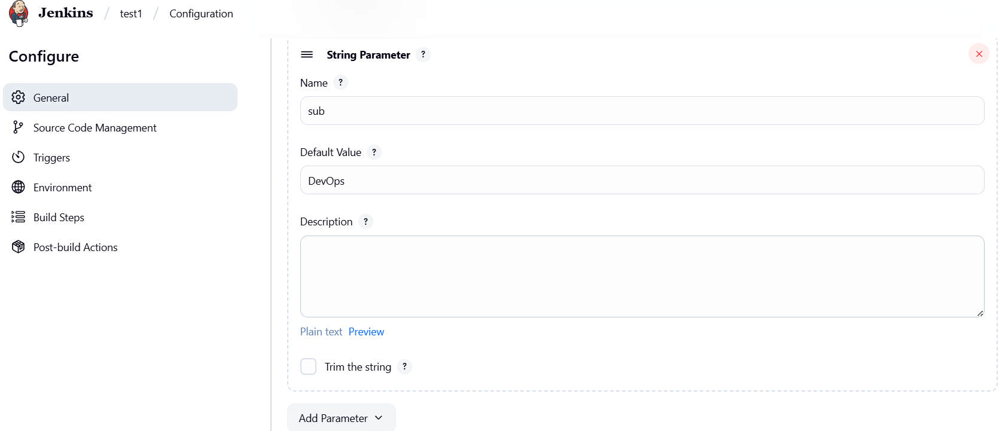
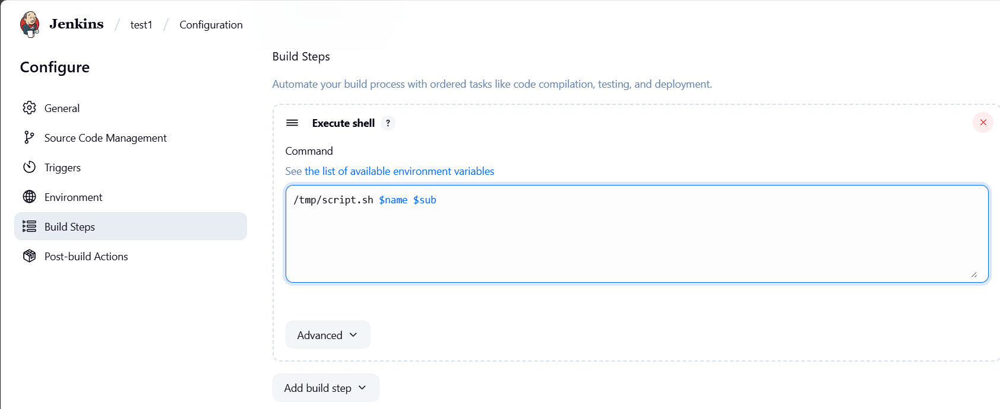
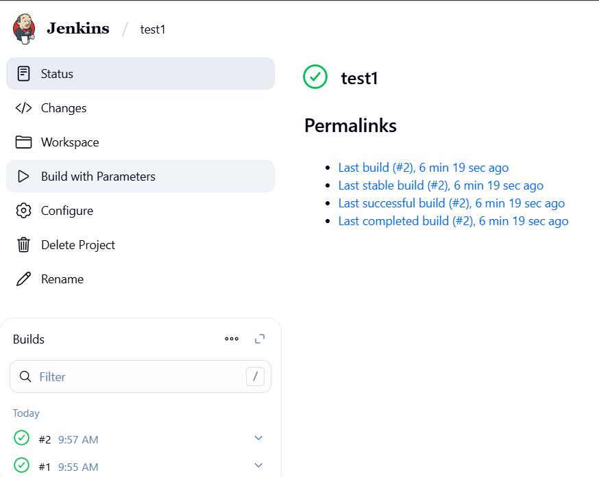
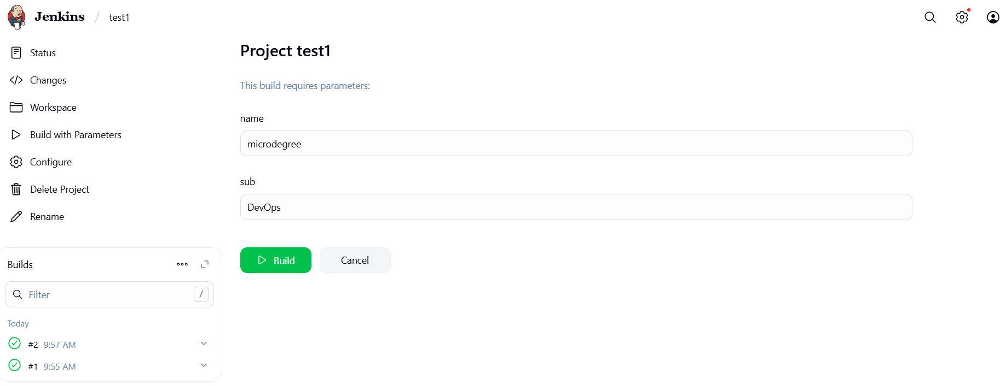
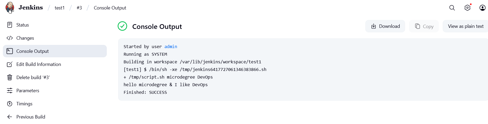
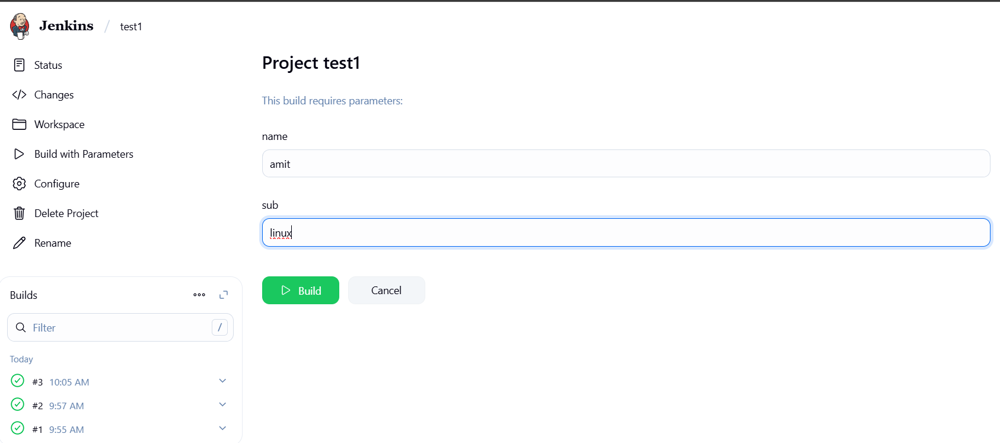
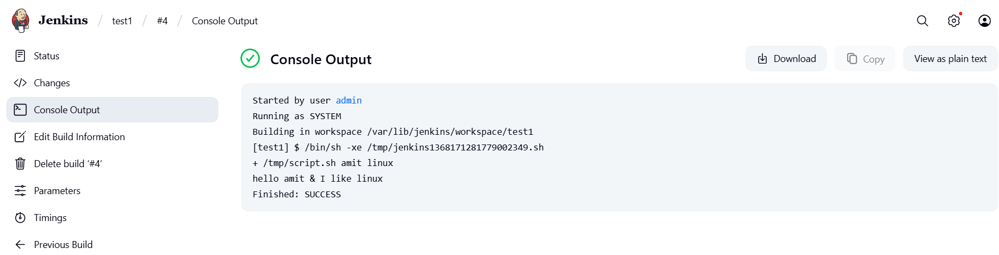

Parameterization of Jenkins: 

Let’s say I made the deployment of this shell script in production environment; two arguments
should be passed. Imagine, I will run this script in Jenkins, and I want to pass arguments how?
Why are we passing arguments? Because if there is an application or monitoring script; I want to get the values by passing values. In that case, I will get the values by parameterization-> parameterization of a Jenkins script. 
Create a simple freestyle project in jenkins:
In execute shell, I will give script path and here we need to pass values: /temp/script.sh swathi k8s
Apply save it-> build now-> Go to console output 
Hello swathi and I like k8 -> execution is happening but it’s not good that every time changing values in execute shell, we should not allow this. Because other users pass values; so, every time changing values inside the execute shell is not good. That is when we use parametrization. 
Go to configure(same project)- tick this project is parametrized-> 
add parameter-string parameter: Name-name, Default value-Microdegree 
adding one more string parameter: Name-sub, default value-DevOps 
Execute shell-> /temp/script.sh $name $sub -> Apply save it. 
click build with parameter:
Name-Microdegree   sub-DevOps , these are the  two default values we have given. 

Click build: Go to last build # - console output- hello Microdegree & I like DevOps.

---
## Parameterization in Jenkins Using Shell Scripts
##### Problem Statement:
Let's say I have a shell script that takes two arguments:
```
[root@jenkins-server ~]# cd /tmp/
[root@jenkins-server tmp]# ls 
script.sh
[root@jenkins-server tmp]# cat script.sh 
#!/bin/bash
name=$1
sub=$2
echo "hello $name & i like $sub" 
```
This script is saved as:
```commandline
[root@jenkins-server tmp]# realpath script.sh
/tmp/script.sh
```
I want to execute this script via Jenkins, and pass dynamic values to it — without hardcoding every time.

##### Why Parameterization is Important
* If you hardcode values in "Execute Shell" like:
```commandline
/tmp/script.sh swathi k8s
```
I will have to edit the job every time you want to change inputs. This is not good practice, especially in teams or production environments.
Solution → Use Jenkins parameters to let users input values at build time, safely and flexibly.

### Step-by-Step: Using Parameters in a Freestyle Jenkins Project
**Step 1: Create a Freestyle Project**
* Go to Jenkins Dashboard → New Item
* Choose Freestyle project
* Give it a name → Click OK

**Step 2: Add Your Shell Script**
* Go to Configure
* Scroll to Build → Add build step → Execute shell
* Add:
```commandline
/tmp/script.sh swathi k8s
```
* Click Save, then Build Now


* ##### Output:


##### But This Is Hardcoded! We Want Dynamic Input
**Step 3: Add Parameterization**
* Go to Configure
* Tick: This project is parameterized
1. First Parameter:

2. Second Parameter:


**Step 4: Modify Execute Shell**

Replace hardcoded values with parameter variables:


Jenkins will now pass the entered values as arguments $1 and $2 to your script.

* Click Apply → Save

**Step 5: Build with Parameters**
* Click Build with Parameters


* You’ll see input fields for name and sub

* Click Build

##### Console Output Example:


##### Leave defaults or change them (e.g., name = Amit, sub = Linux)




Click build with paramerts:


