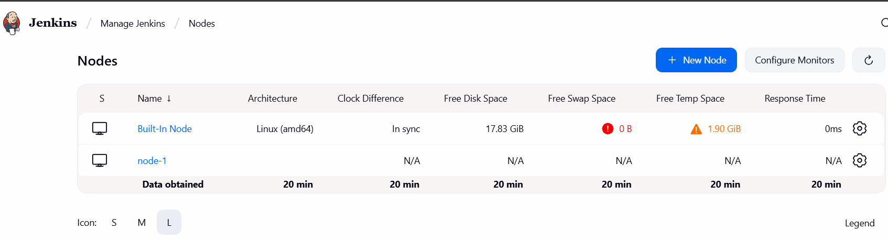

Parameterization of Jenkins: 
[root@jenkins-server tmp]# ls 
script.sh
[root@jenkins-server tmp]# cat script.sh 
#!/bin/bash
name=$1
sub=$2
echo "hello $name & i like $sub" 
Let’s say I made the deployment of this shell script in production environment; two arguments
should be passed. Imagine, I will run this script in Jenkins, and I want to pass arguments how?
Why are we passing arguments? Because if there is an application or monitoring script; I want to get the values by passing values. In that case, I will get the values by parameterization-> parameterization of a Jenkins script.
[root@jenkins-server tmp]# realpath script.sh
/tmp/script.sh 
Create a simple freestyle project in jenkins:
In execute shell, I will give script path and here we need to pass values: /temp/script.sh swathi k8s
Apply save it-> build now-> Go to console output 
Hello swathi and I like k8 -> execution is happening but it’s not good that every time changing values in execute shell, we should not allow this. Because other users pass values; so, every time changing values inside the execute shell is not good. That is when we use parametrization. 
Go to configure(same project)- tick this project is parametrized-> 
add parameter-string parameter: Name-name, Default value-Microdegree 
adding one more string parameter: Name-sub, default value-DevOps 
Execute shell-> /temp/script.sh $name $sub -> Apply save it. 
click build with parameter:
Name-Microdegree   sub-DevOps , these are the  two default values we have given. 

Click build: Go to last build # - console output- hello Microdegree & I like DevOps. 

Click build with paramerts:

