### Jenkins Pipeline: Checkout the Development Branch and Execute Code
#### How to checkout specific branch:
##### 1. Objective:
I want to checkout the development branch and execute the code from development using a Jenkins pipeline.

##### 2. Jenkins Pipeline Script:
##### Jenkinsfile
```commandline
pipeline {  
    agent any

    stages {  
        stage('Git Checkout') { 
            steps { 
                git branch: 'development', url: 'https://github.com/Swathi971/demo.git'
            } 
        }  
    }  
}
```
##### 3. Jenkins Setup:
* Go to Jenkins Dashboard → New Item Enter item name: test1-pipeline → Select: Pipeline → Click OK
* Scroll to Pipeline → Definition: Pipeline script → Paste the above script → Click Apply → Save → Click Build Now

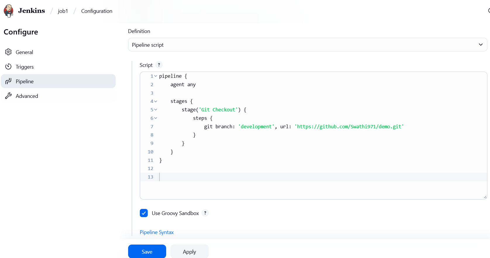

##### 4. Error: Git Clone Failed
I encountered the following error: 
```commandline
❌ Error in cloning repository
```
Click build now-> click on the failed build and select console output.

##### 5. Manual Clone (Troubleshooting Step):
To check whether it's a network or permission issue, run this on Jenkins server:
```commandline
[root@jenkins-server ~]# git clone https://github.com/Swathi971/demo.git
```
If this works, the issue is likely one of the following:
* Jenkins does not have git installed
* Jenkins does not have internet access
* Jenkins user lacks SSH key / credentials (if repo is private)

##### Trigger the Jenkins Pipeline
* Go to Jenkins Dashboard
* Select your pipeline job (e.g., test1-pipeline)
* Click Build Now
* Once the build finishes, click on the build number (e.g., #1)
* Click Console Output
You should see:
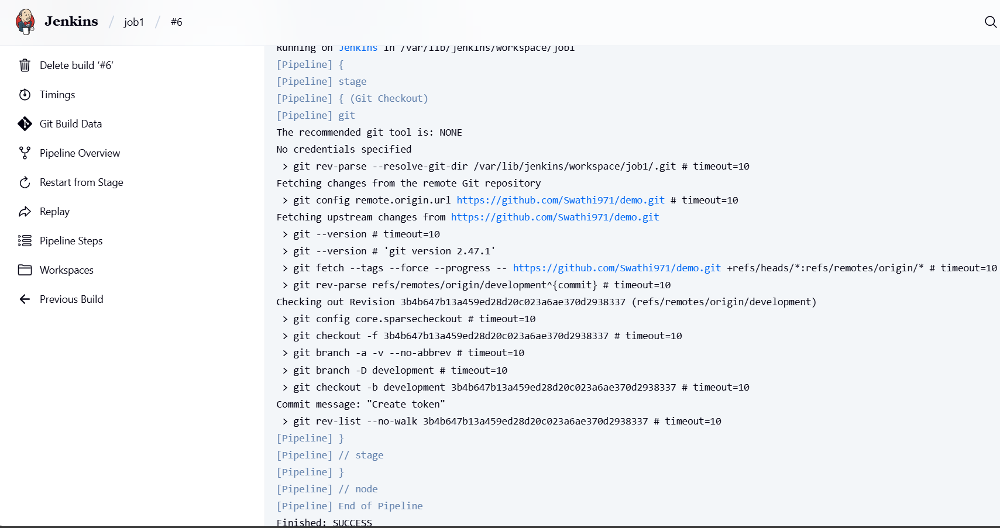

This means the Jenkins pipeline successfully:
* Checked out the development branch
* Executed the code (as defined in the pipeline stages)
___
### Automating Jenkins Pipeline with GitHub Branch (No Manual Branch Switch)
#### Use a Pipeline Project with Jenkinsfile from GitHub
##### Step 1: Push Jenkinsfile to swathi Branch
* Open Visual Studio Code
* Add your Jenkinsfile under a folder (e.g., jenkins/Jenkinsfile)
* Stage → Commit → Sync Changes
Now your Jenkinsfile is in the swathi branch on GitHub
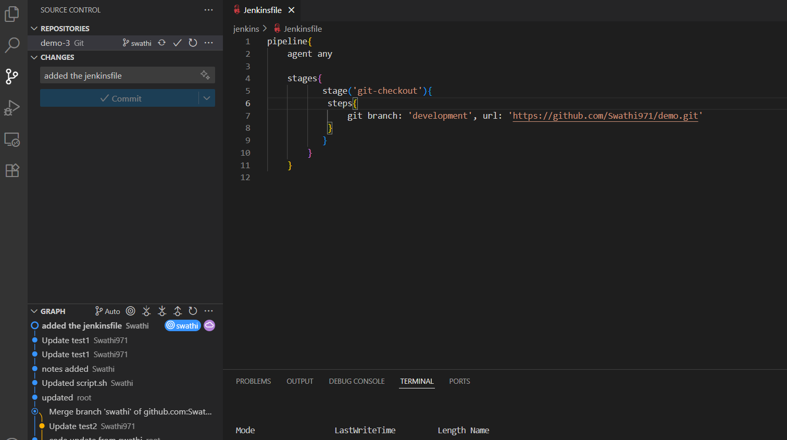
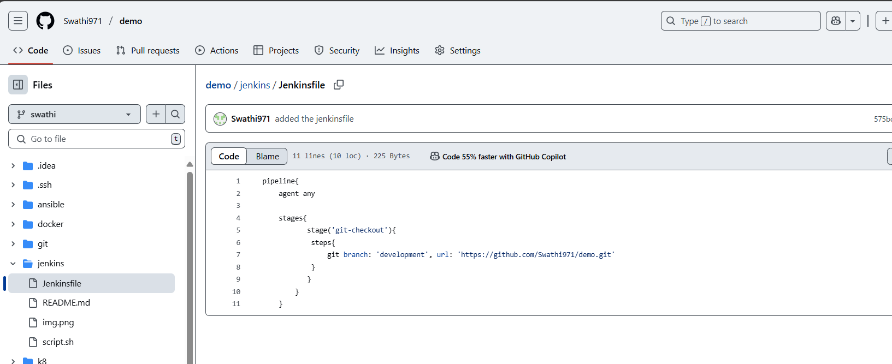

##### Step 2: Configure Jenkins Pipeline Job
* Go to Jenkins → New Item → Name it (e.g., test-pipeline) → Choose Pipeline → OK

##### Step 3: Configure Git Repository and Jenkinsfile
* Scroll down to the Pipeline section
* Select: Pipeline script from SCM
* SCM: Git
* Repository URL:
```commandline
https://github.com/Swathi971/demo.git
```
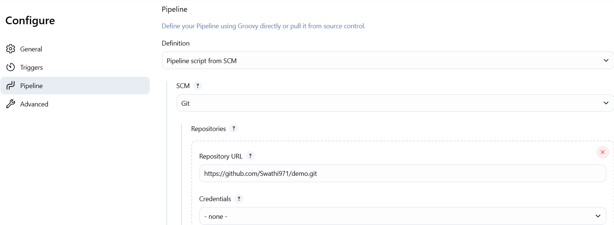

* Branch Specifier:
```commandline
*/swathi
```
* Script path(path to Jenkinsfile inside the repo):
```commandline
jenkins/Jenkinsfile
```
Make sure this path matches the actual location in your GitHub repo.
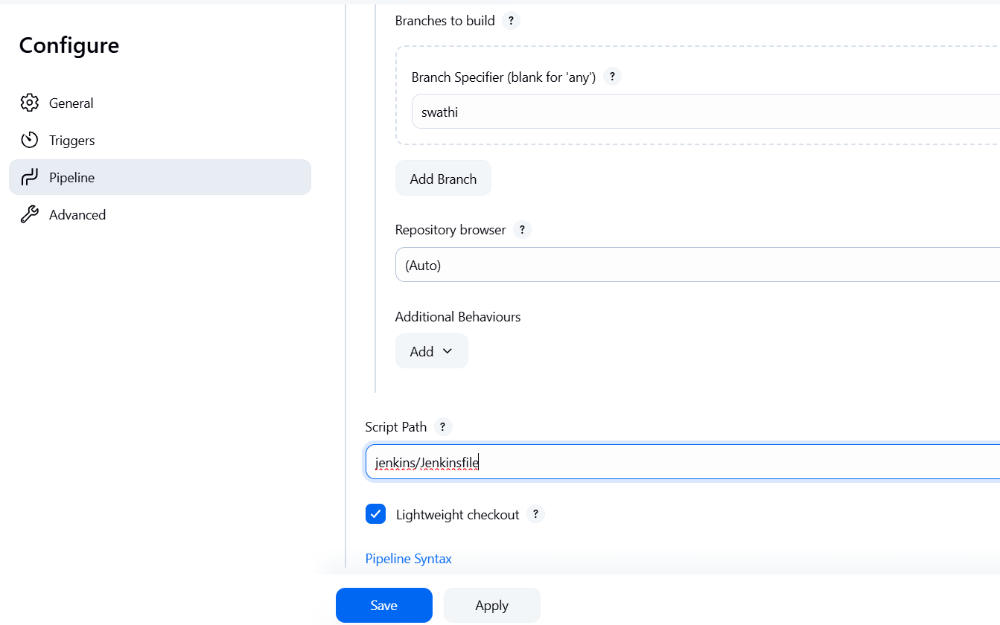
* Click Apply → Save

##### Step 4: Trigger Build
* Click Build Now → Go to Console Output
* If configured correctly, Jenkins will:
    * Checkout the swathi branch to read the Jenkinsfile 
    * Inside the Jenkinsfile, it will checkout the development branch for the actual application code
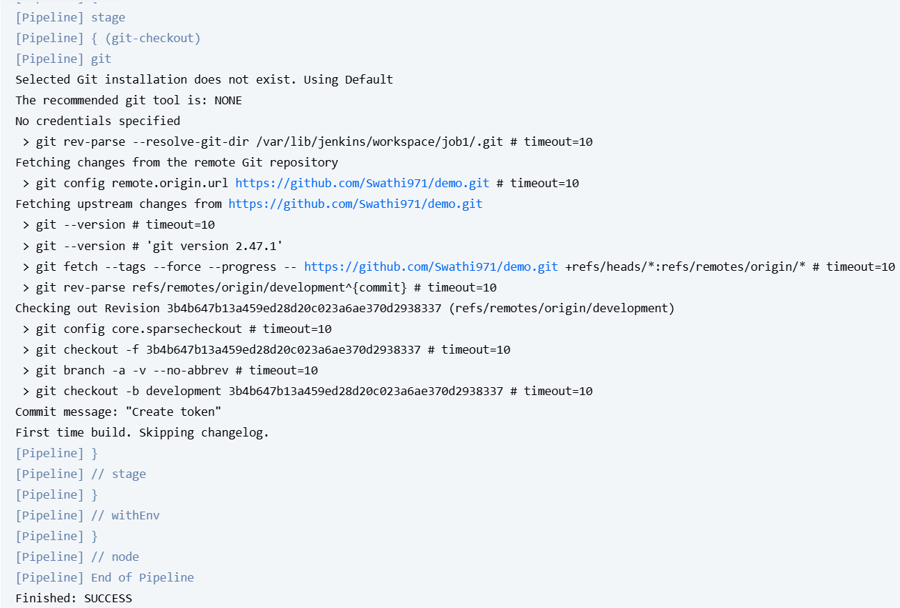

---
#### Visualize Jenkins Pipeline stages clearly using the Pipeline Stage View plugin
When running pipelines, it's hard to understand:
* Which stage is currently running
* What each stage is doing
* Where the pipeline failed (if it did)

##### Step 1: Install Plugin
Go to Jenkins Dashboard → Click Manage Jenkins → Manage Plugins → Select the Available tab → Search for Pipeline Stage View → Check the box → Click Install → Go back to top page

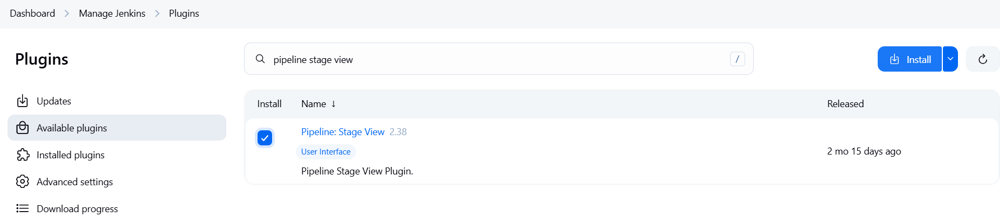

##### Step 2: Use the Plugin in Your Pipeline Job
* Go to your pipeline job (e.g., test1-pipeline)
* Run the pipeline by clicking Build Now
* You will now see a Stage View section
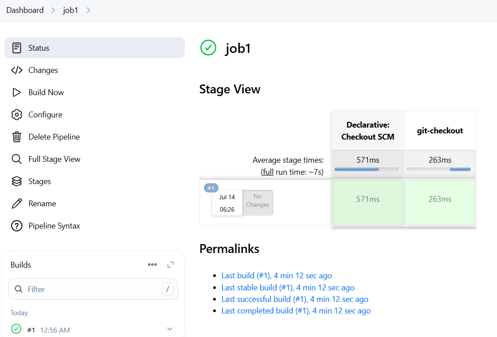

This shows:
* Each stage as a box (e.g., Git Checkout, Compile, Build)
* Real-time status (e.g., In Progress, Passed, Failed)
* Execution time per stage

##### Step 3: View Detailed Logs for Each Stage
* Click on any stage name (like Git Checkout)
You’ll see the Console Output for that specific stage
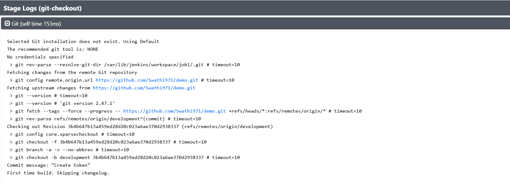

---
#### Java Maven Project – Jenkins Pipeline Setup Guide
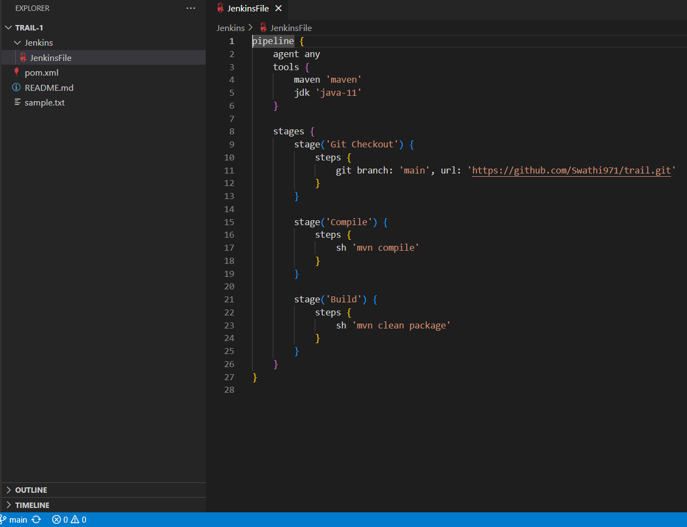

##### Step 1: Jenkinsfile in GitHub
```commandline
pipeline {
    agent any

    stages {
        stage('git-checkout') {
            steps {
                git branch: 'main', url: 'https://github.com/Swathi971/trail.git'
            }
        }

        stage('compile') {
            steps {
                sh 'mvn compile'
            }
        }

        stage('build') {
            steps {
                sh 'mvn clean package'
            }
        }
    }
}
```
##### Step 2: Create a New Pipeline in Jenkins
* Go to Jenkins Dashboard → Click New Item → Enter name:Project-1 → Select Pipeline → Click OK
* In Pipeline Configuration:
    * Choose: Pipeline script from SCM
    * SCM: Git 
    * Repository URL: https://github.com/Swathi971/trail.git
    * Branch Specifier: main
    * Script Path: Jenkins/JenkinsFile
* Click Apply → Save
* Click Build now
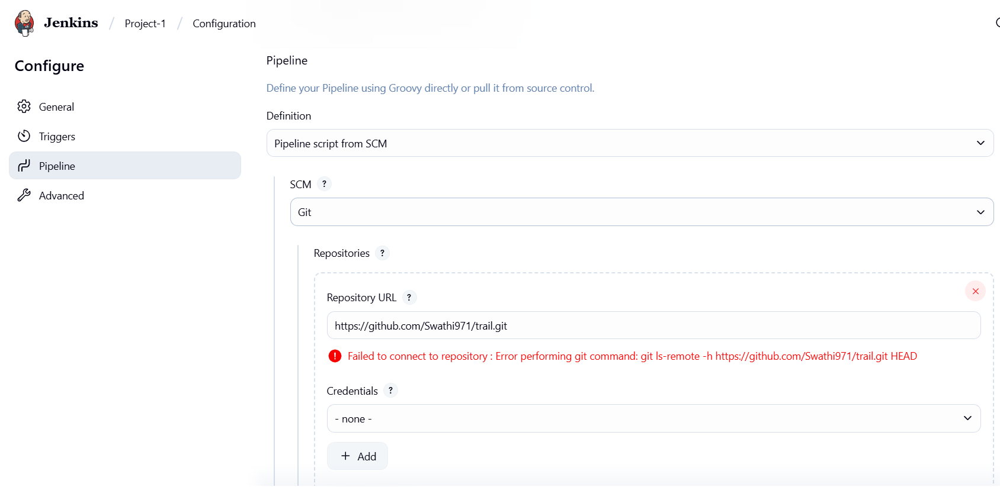

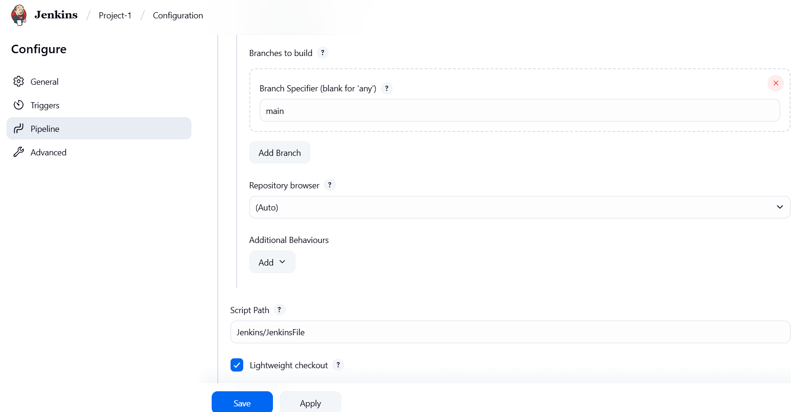


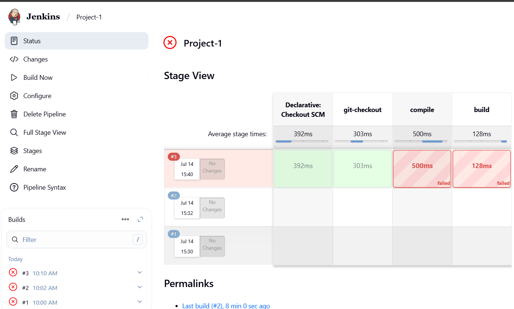

##### Step 3: Error – mvn Not Found
Install Maven in Jenkins:
* Dashboard → Manage Jenkins → Tools
* Under Maven:
    * Click Add Maven 
    * Name: maven 
    * Select: Install automatically 
    * Choose a Maven version (e.g., 3.8.6)
    * Click Apply → Save

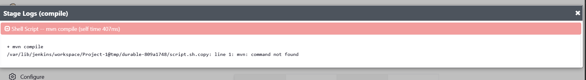 
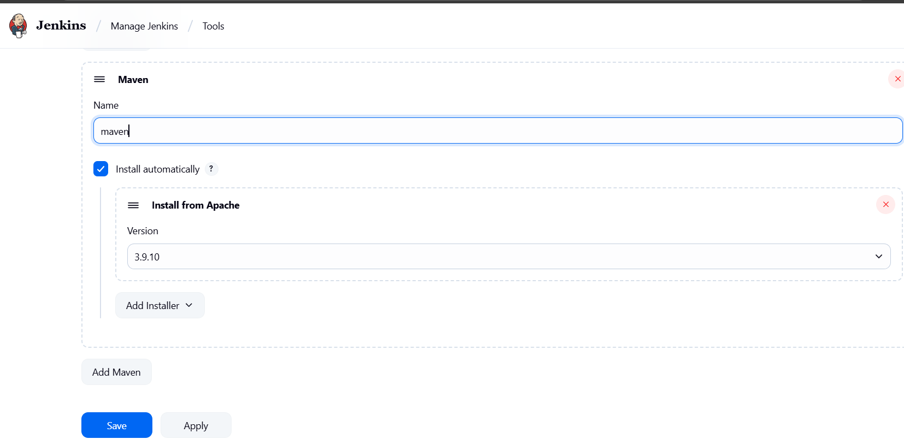

##### Step 4: Java Version Error (Running in Java 17, Need Java 11)
Install Java 11 (Adoptium):

Maven plugin must be installed before managing Java tools.
* Dashboard → Manage Jenkins → Manage Plugins 
* Go to Available Plugins 
* Search: Eclipse Temurin installer

✅ Check it → Click Install without restart
So, I must show that I am using maven in this pipeline; for that we have one option called tools section. Here I have mentioned that I am using maven tool in this pipeline (VS code)- commit message from vs code to Github:
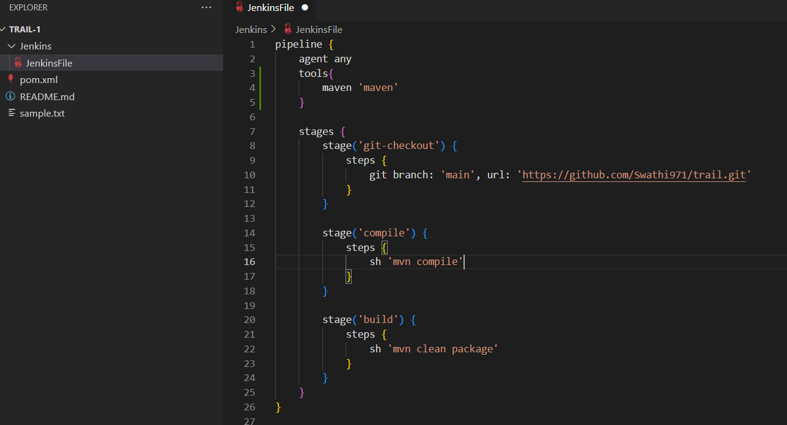

Build now:
 i am running this entire code in java-17. But I need java-11.
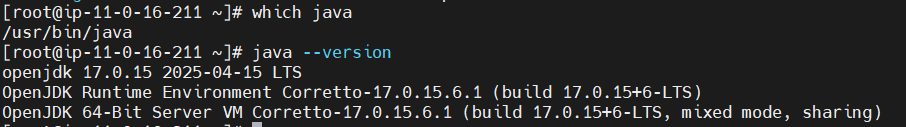

 Install Java:

To install any Java products, maven plugin should be installed. So go to plugins- available plugins-search eclipse- eclipse tumerin installer-it provides an installer for JDK
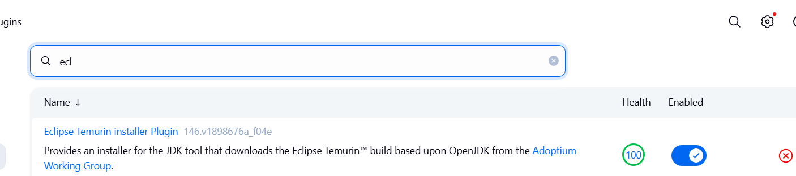

Go back to tools-> add jdk- name java-11-install  automatically- adoptioum.net-look for java 11
Apply-save 
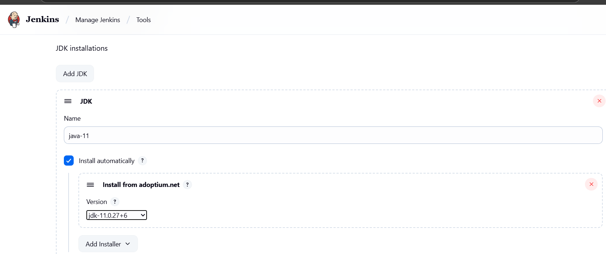

Now we must tell jenkins that use java –11:
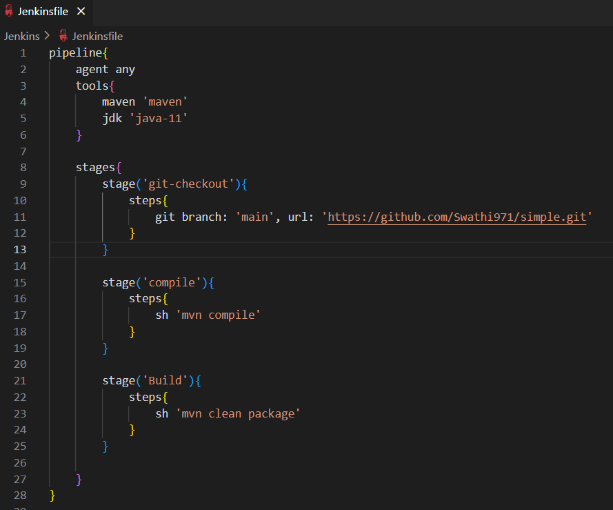

Error because there was not pom.xml:
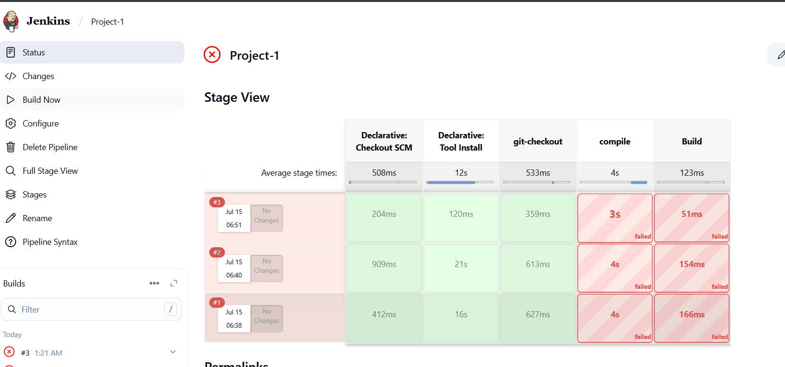

Build success:
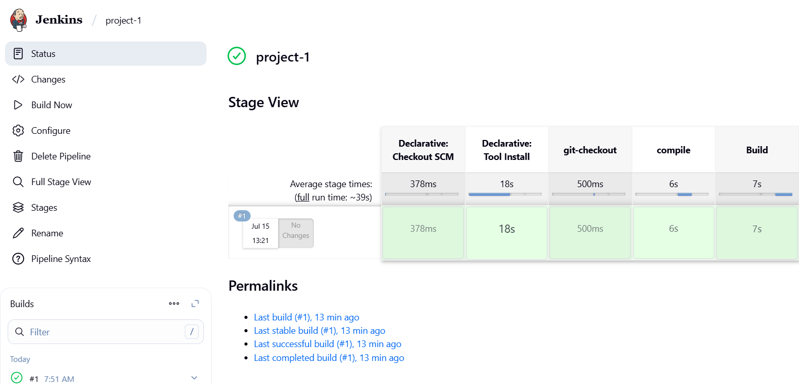

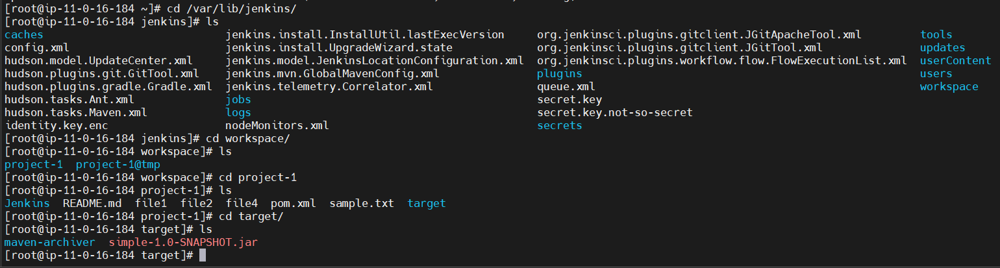
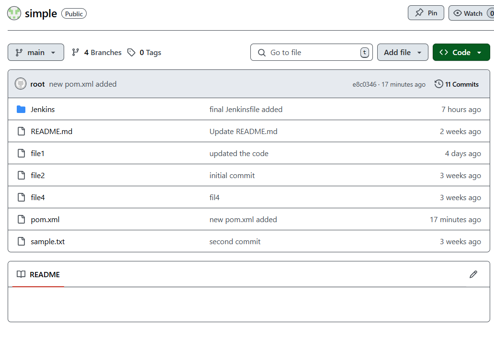

pom.xml:
```commandline
<project xmlns="http://maven.apache.org/POM/4.0.0"
         xmlns:xsi="http://www.w3.org/2001/XMLSchema-instance"
         xsi:schemaLocation="http://maven.apache.org/POM/4.0.0 http://maven.apache.org/xsd/maven-4.0.0.xsd">

  <modelVersion>4.0.0</modelVersion>

  <groupId>com.example</groupId>
  <artifactId>simple</artifactId>
  <version>1.0-SNAPSHOT</version>

  <properties>
    <maven.compiler.source>11</maven.compiler.source>
    <maven.compiler.target>11</maven.compiler.target>
  </properties>

  <build>
    <plugins>
      <!-- Compiler Plugin to use Java 11 -->
      <plugin>
        <groupId>org.apache.maven.plugins</groupId>
        <artifactId>maven-compiler-plugin</artifactId>
        <version>3.8.1</version>
        <configuration>
          <source>11</source>
          <target>11</target>
        </configuration>
      </plugin>

      <!-- Optional: Plugin to create an executable JAR -->
      <plugin>
        <groupId>org.apache.maven.plugins</groupId>
        <artifactId>maven-jar-plugin</artifactId>
        <version>3.2.2</version>
        <configuration>
          <archive>
            <manifest>
              <mainClass>com.example.App</mainClass> <!-- Must match your class with main() -->
            </manifest>
          </archive>
        </configuration>
      </plugin>
    </plugins>
  </build>

</project>
```
 


