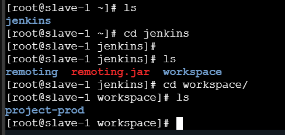
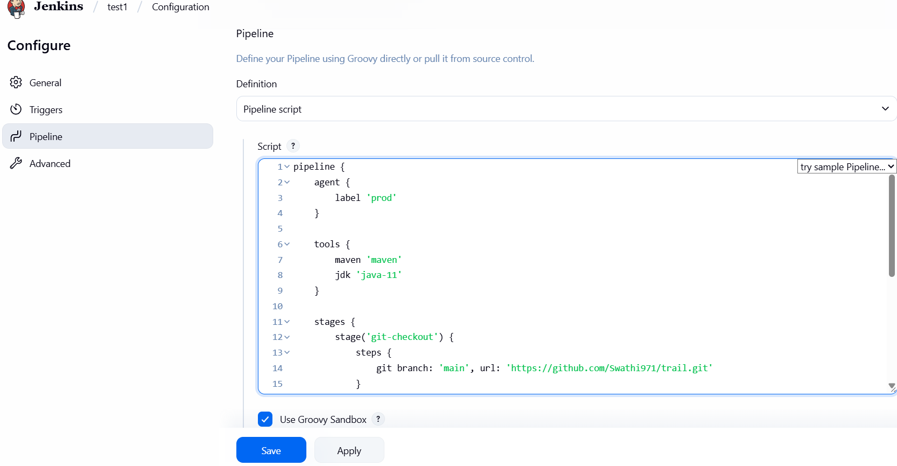

### Jenkins Pipeline: Checkout the Development Branch and Execute Code
#### How to checkout specific branch:
##### 1. Objective:
I want to checkout the development branch (even though the Jenkinsfile is pushed(from VS code) to the swathi branch) and execute the code from development using a Jenkins pipeline.

##### 2. Jenkins Pipeline Script:
##### Jenkinsfile
```commandline
pipeline {  
    agent any

    stages {  
        stage('Git Checkout') { 
            steps { 
                git branch: 'development', url: 'https://github.com/Swathi971/demo.git'
            } 
        }  
    }  
}
```
##### 3. Jenkins Setup:
* Go to Jenkins Dashboard → New Item Enter item name: test1-pipeline → Select: Pipeline → Click OK
* Scroll to Pipeline → Definition: Pipeline script → Paste the above script → Click Apply → Save → Click Build Now


##### 4. Error: Git Clone Failed
I encountered the following error: ❌ Error in cloning repository
Click build now-> click on the failed build and select console output.

##### 5. Manual Clone (Troubleshooting Step):
To check whether it's a network or permission issue, run this on Jenkins server:
```commandline
[root@jenkins-server ~]# git clone https://github.com/Swathi971/demo.git
```
If this works, the issue is likely one of the following:
* Jenkins does not have git installed
* Jenkins does not have internet access
* Jenkins user lacks SSH key / credentials (if repo is private)

Go to Jenkins-> Buil now-console output- success 

___
This is the manual method but can’t change the git branch every time. 
So, what we can do is: 

First, we need to push the code which is in VS-> added the Jenkinsfile –commit- sync changes


Now when go to GitHub, Jenkinsfile will be there in swathi branch. 


Go to configure-> pipeline script->pipeline script from SCM-> SCM-Git-> Copy and paste the repository URL-> Branch specifier- swathi-> Script path- go to jenkinsfile in swathi branch and copy the script path and paste it here jenkins/Jenkinsfile- apply-save



I am running the pipelines but there is no proper structuring means I have no idea that what is happening in which stages: 
Go to dashboard-> manage Jenkins-> Plugins-available plugins and type- pipeline stage view- click it and install- go back to top page


 Go to test1:


Click on logs in git checkout-> we can see the logs. 

---

 [Created the new repo called trail -> Creating new folder called jenkins-> creating the jenkinsfile inside the folder in VS code 
https://github.com/Swathi971/trail 

Copy the code from Jenkinsfile which is in https://github.com/ManojKRISHNAPPA/Project-movie-app/tree/main]


 All these are gotten it from Maven life cycle:
[Introduction to the Build Lifecycle – Maven](https://maven.apache.org/guides/introduction/introduction-to-the-lifecycle.html)

##### Jenkinsfile
```commandline
pipeline {
    agent any

    stages {
        stage('git-checkout') {
            steps {
                git branch: 'main', url: 'https://github.com/Swathi971/trail.git'
            }
        }

        stage('compile') {
            steps {
                sh 'mvn compile'
            }
        }

        stage('build') {
            steps {
                sh 'mvn clean package'
            }
        }
    }
}
```
Now we will create a new pipeline:
Project-1-pipeline-OK-> Pipeline script from SCM-> SCM- Git-> Branch specifier- main-> Script path-> Jenkins/JenkinsFile-> Apply- save.

Here I got the error, so I cloned to trail branch manually in terminal.


Click Build now:

Errors: mvn file is not here

 Install maven:
Dashboard-> manage jenkins-> tools- maven Installation- name-maven- apply save. 


So, I must show that I am using maven in this pipeline; for that we have one option called tools section. Here I have mentioned that I am using maven tool in this pipeline (VS code)- commit message from vs code to Github:


Build now:
 i am running this entire code in java-17. But I need java-11.


 Install Java:

To install any Java products, maven plugin should be installed. So go to plugins- available plugins-search eclipse- eclipse tumerin installer-it provides an installer for JDK


Go back to tools-> add jdk- name java-11-install  automatically- adoptioum.net-look for java 11
Apply-save 


Now we must tell jenkins that use java –11:


Error because there was not pom.xml:


Build success:


pom.xml:
```commandline
<project xmlns="http://maven.apache.org/POM/4.0.0"
         xmlns:xsi="http://www.w3.org/2001/XMLSchema-instance"
         xsi:schemaLocation="http://maven.apache.org/POM/4.0.0 http://maven.apache.org/xsd/maven-4.0.0.xsd">

  <modelVersion>4.0.0</modelVersion>

  <groupId>com.example</groupId>
  <artifactId>simple</artifactId>
  <version>1.0-SNAPSHOT</version>

  <properties>
    <maven.compiler.source>11</maven.compiler.source>
    <maven.compiler.target>11</maven.compiler.target>
  </properties>

  <build>
    <plugins>
      <!-- Compiler Plugin to use Java 11 -->
      <plugin>
        <groupId>org.apache.maven.plugins</groupId>
        <artifactId>maven-compiler-plugin</artifactId>
        <version>3.8.1</version>
        <configuration>
          <source>11</source>
          <target>11</target>
        </configuration>
      </plugin>

      <!-- Optional: Plugin to create an executable JAR -->
      <plugin>
        <groupId>org.apache.maven.plugins</groupId>
        <artifactId>maven-jar-plugin</artifactId>
        <version>3.2.2</version>
        <configuration>
          <archive>
            <manifest>
              <mainClass>com.example.App</mainClass> <!-- Must match your class with main() -->
            </manifest>
          </archive>
        </configuration>
      </plugin>
    </plugins>
  </build>

</project>
```
 


