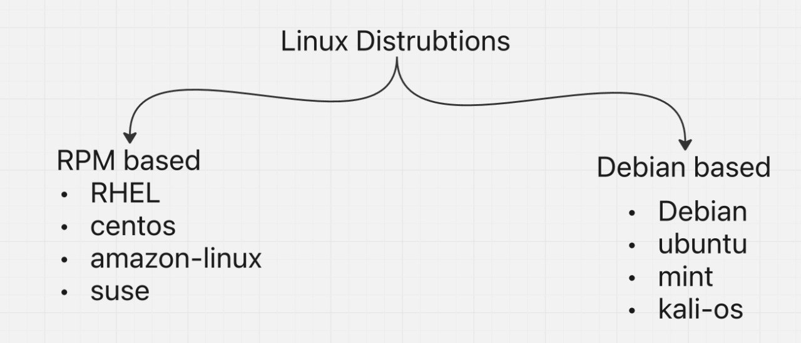
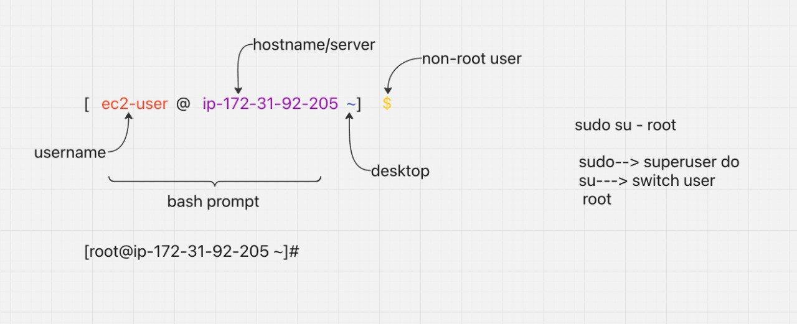

##### Stress Commands:
```commandline
sudo yum install stress -y
```
```commandline
nohup sudo stress --cpu 8 -v --timeout 30000 &
nohup sudo stress --cpu 8 -v --timeout 30000 &
nohup sudo stress --cpu 8 -v --timeout 30000 &
nohup sudo stress --cpu 8 -v --timeout 30000 &
nohup sudo stress --cpu 8 -v --timeout 30000 &
nohup sudo stress --cpu 8 -v --timeout 30000 &
nohup sudo stress --cpu 8 -v --timeout 30000 &
nohup sudo stress --cpu 8 -v --timeout 30000 &
```
##### Mail_Alert:
````commandline
#!/bin/bash

THRESHOLD=70
cpu_usage=$(top -bn1 | grep "Cpu(s)" | sed "s/.*, *\([0-9.]*\)%* id.*/\1/" | awk '{print 100 -$1}')
if (( $(echo "$cpu_usage > $THRESHOLD" | bc -l ) )); then
	echo "WARNING!!!!!!: CPU usgae is above $THRESHOLD%. current usage: $cpu_usage%" | mail -s "CPU usage Alert" jagdishsiddaiah2408@gmail.com
fi
````
---
##### These are some important day-to-day production environment issues. If interviewer asks what has been implemented in shell script...
```commandline
cd "C:\path\to\your\key"
icacls "Mypem.key" /inheritance:r /grant:r "%username%:R"
```
* Verify for read access:
```commandline
icacls "Mypem.key"
```
1. **Disk Space Monitoring Script**
```commandline
#!/bin/bash

THRESHOLD=90
EMAIL="admin@example.com"

disk_usage=$(df / | tail -1 | awk '{print $5}' | sed 's/%//')

if [ "$disk_usage" -gt "$THRESHOLD" ]; then
  echo "Disk usage is above $THRESHOLD%. Current usage: $disk_usage%" | mail -s "Disk Space Alert" $EMAIL
fi
```
2. **Backup script**
```commandline
#!/bin/bash

SOURCE_DIR="/var/www/html"
DEST_DIR="/backup/server/"
REMOTE_SERVER="user@remote_server:/backup/"

rsync -avz --delete $SOURCE_DIR $REMOTE_SERVER$DEST_DIR
```
3. **Log Rotation Script**
```commandline
#!/bin/bash

LOG_DIR="/var/log/myapp"
LOG_ARCHIVE_DIR="/var/log/archive"
MAX_LOG_SIZE=10000000  # Max size of logs before rotation (10MB)

for logfile in $LOG_DIR/*; do
  log_size=$(stat -c %s "$logfile")
  if [ "$log_size" -gt "$MAX_LOG_SIZE" ]; then
    mv $logfile $LOG_ARCHIVE_DIR/$(basename "$logfile").$(date +%F).gz
    gzip $LOG_ARCHIVE_DIR/$(basename "$logfile").$(date +%F).gz
  fi
done
```
4. **MySQL Database Backup**
```commandline
#!/bin/bash

DB_USER="root"
DB_PASSWORD="password"
DB_NAME="mydatabase"
BACKUP_DIR="/backup/mysql/"

DATE=$(date +\%F)
BACKUP_FILE="$BACKUP_DIR$DB_NAME-$DATE.sql"

mysqldump -u $DB_USER -p$DB_PASSWORD $DB_NAME > $BACKUP_FILE

if [ $? -eq 0 ]; then
  echo "Backup successful!"
else
  echo "Backup failed!" | mail -s "MySQL Backup Failure" admin@example.com
fi
```
5. **Server Health Monitoring**
```commandline
shell
shell
shell
#!/bin/bash

CPU_THRESHOLD=90
MEMORY_THRESHOLD=80
LOAD_THRESHOLD=5

CPU_USAGE=$(top -bn1 | grep "Cpu(s)" | sed "s/.*, *\([0-9.]*\)%* id.*/\1/" | awk '{print 100 - $1}')
MEMORY_USAGE=$(free | grep Mem | awk '{print $3/$2 * 100.0}')
LOAD=$(uptime | awk '{print $10}' | sed 's/,//')

if [ $(echo "$CPU_USAGE > $CPU_THRESHOLD" | bc) -eq 1 ]; then
  echo "CPU usage is high: $CPU_USAGE%" | mail -s "High CPU Usage Alert" admin@example.com
fi

if [ $(echo "$MEMORY_USAGE > $MEMORY_THRESHOLD" | bc) -eq 1 ]; then
  echo "Memory usage is high: $MEMORY_USAGE%" | mail -s "High Memory Usage Alert" admin@example.com
fi

if [ $(echo "$LOAD > $LOAD_THRESHOLD" | bc) -eq 1 ]; then
  echo "System load is high: $LOAD" | mail -s "High System Load Alert" admin@example.com
fi
```
6. **Automated Software Updates**
```#!/bin/bash

sudo apt update && sudo apt upgrade -y
sudo apt autoremove -y
```
7. **Cron Job Status Monitoring**
```#!/bin/bash

CRON_LOG="/var/log/syslog"
ERROR_COUNT=$(grep "CRON" $CRON_LOG | grep -i "error" | wc -l)

if [ $ERROR_COUNT -gt 0 ]; then
  echo "There were $ERROR_COUNT cron job errors." | mail -s "Cron Job Error Alert" admin@example.com
fi
```
8. **System Resource Cleanup**
````
#!/bin/bash

# Clear apt cache (Debian/Ubuntu)
sudo apt-get clean

# Remove old logs
find /var/log -type f -name "*.log" -exec rm -f {} \;

# Clear temp files
rm -rf /tmp/*
````
9. **SSL Certificate Expiry Check**
```#!/bin/bash

DOMAIN="example.com"
THRESHOLD_DAYS=30

EXPIRY_DATE=$(openssl s_client -connect $DOMAIN:443 -servername $DOMAIN < /dev/null 2>/dev/null | openssl x509 -noout -dates | grep 'notAfter' | sed 's/notAfter=//')
EXPIRY_DATE_TIMESTAMP=$(date -d "$EXPIRY_DATE" +%s)
CURRENT_DATE_TIMESTAMP=$(date +%s)

DAYS_LEFT=$(( ($EXPIRY_DATE_TIMESTAMP - $CURRENT_DATE_TIMESTAMP) / 86400 ))

if [ $DAYS_LEFT -lt $THRESHOLD_DAYS ]; then
  echo "SSL certificate for $DOMAIN will expire in $DAYS_LEFT days." | mail -s "SSL Certificate Expiry Alert" admin@example.com
fi
```
##### msmtp configuration:
```commandline
#!/bin/bash

# Update and install msmtp
sudo apt-get update
sudo apt-get install -y msmtp msmtp-mta ca-certificates

# Create the msmtp configuration directory
mkdir -p ~/.msmtp

# Create the msmtp configuration file
cat <<EOF > ~/.msmtprc
# Set default values for all accounts.
defaults
auth           on
tls            on
tls_trust_file /etc/ssl/certs/ca-certificates.crt
logfile        ~/.msmtp/msmtp.log

# Gmail account
account        gmail
host           smtp.gmail.com
port           587
from           manojdevopstest@gmail.com
user           manojdevopstest@gmail.com
password       lerkbxagiltjnfos

# Set a default account
account default : gmail
EOF

# Set the correct permissions for the msmtp configuration file
chmod 600 ~/.msmtprc

# Create a log file for msmtp
touch ~/.msmtp/msmtp.log
chmod 600 ~/.msmtp/msmtp.log

echo "msmtp configuration completed. You can now send emails using the configured Gmail account."
```
---


